## Clinicopathologic features

```r
# Loading the dataset for analysis
source("PFCK_RCC_Tidy.R")
# Loading the simpleR package
library(simpleR)
```

### Patient's age at diagnosis

```r
var <- Data_Wide$Age
lab <- "Patient's age, yrs"
numerical.plot(var, label = lab)
```

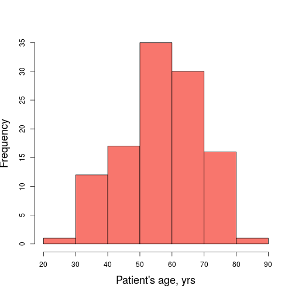 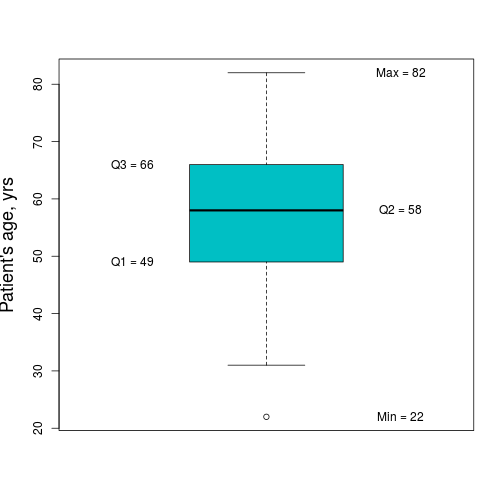 

```r
descriptive.numerical(var)
```


|Statistics          | Values |
|:-------------------|:------:|
|Mean                |  57.2  |
|Standard Deviation  |  12.4  |
|Median              |   58   |
|Interquartile Range |   17   |
|Mininum             |   22   |
|Maximum             |   82   |

***

### Patient's sex

```r
var <- Data_Wide$Sex
categorical.plot(var)
```

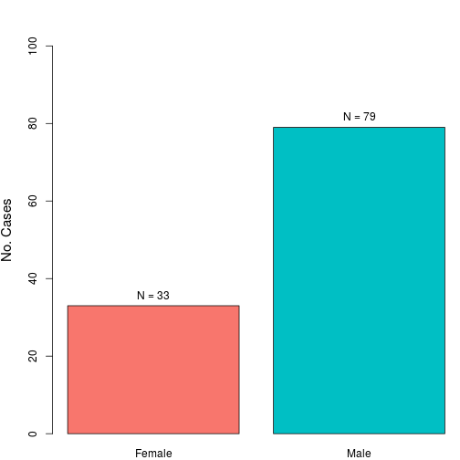 

```r
descriptive.categorical(var)
```


|       | No. Cases | %  |
|:------|:---------:|:--:|
|Female |    33     | 29 |
|Male   |    79     | 71 |

***

### Patient's race

```r
var <- Data_Wide$Race
categorical.plot(var)
```

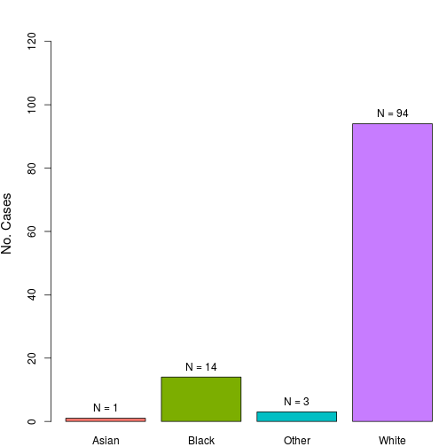 

```r
descriptive.categorical(var)
```


|      | No. Cases |   %   |
|:-----|:---------:|:-----:|
|Asian |     1     |  0.89 |
|Black |    14     | 12.50 |
|Other |     3     |  2.68 |
|White |    94     | 83.93 |

***

### pT stage

```r
var <- Data_Wide$pT
categorical.plot(var)
```

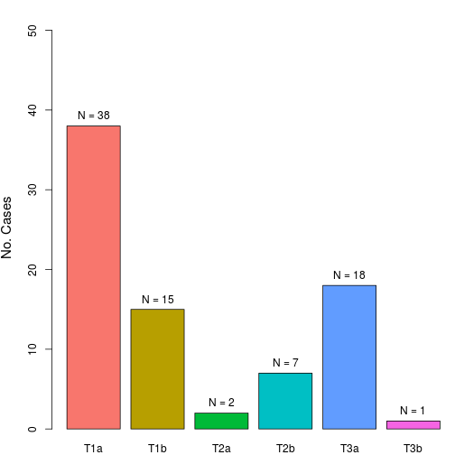 

```r
descriptive.categorical(var)
```


|    | No. Cases |  %   |
|:---|:---------:|:----:|
|T1a |    38     | 46.9 |
|T1b |    15     | 18.5 |
|T2a |     2     |  2.5 |
|T2b |     7     |  8.6 |
|T3a |    18     | 22.2 |
|T3b |     1     |  1.2 |

***

### Fuhrman grade

```r
var <- Data_Wide$Fuhrman
categorical.plot(var)
```

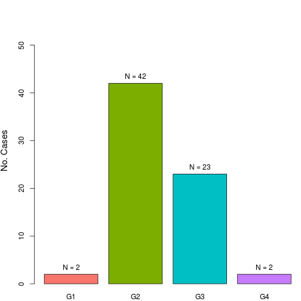 

```r
descriptive.categorical(var)
```


|   | No. Cases |  %   |
|:--|:---------:|:----:|
|G1 |     2     |  2.9 |
|G2 |    42     | 60.9 |
|G3 |    23     | 33.3 |
|G4 |     2     |  2.9 |

***

### Multifocal tumor

```r
var <- Data_Wide$Multifocal
categorical.plot(var)
```

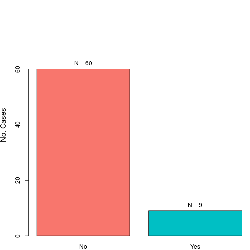 

```r
descriptive.categorical(var)
```


|    | No. Cases | %  |
|:---|:---------:|:--:|
|No  |    60     | 87 |
|Yes |     9     | 13 |

***

### Tumor surgical margin

```r
var <- Data_Wide$Margin
categorical.plot(var)
```

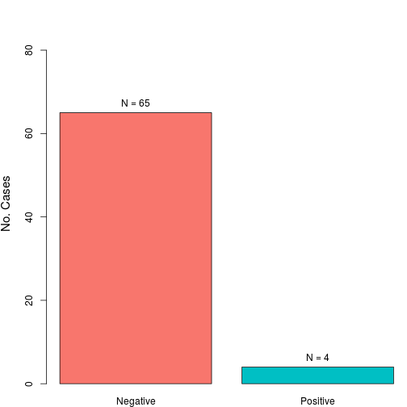 

```r
descriptive.categorical(var)
```


|         | No. Cases |  %   |
|:--------|:---------:|:----:|
|Negative |    65     | 94.2 |
|Positive |     4     |  5.8 |

***

### Tumor size

```r
var <- Data_Wide$Size
lab <- "Tumor size, cm"
numerical.plot(var, label = lab)
```

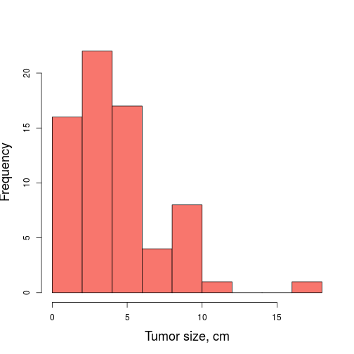 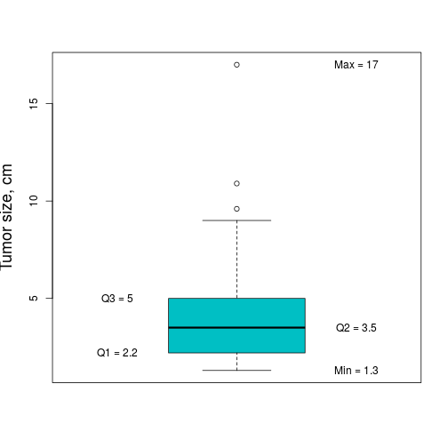 

```r
descriptive.numerical(var)
```


|Statistics          | Values |
|:-------------------|:------:|
|Mean                |  4.3   |
|Standard Deviation  |  2.9   |
|Median              |  3.5   |
|Interquartile Range |  2.8   |
|Mininum             |  1.3   |
|Maximum             |   17   |

***

### Tumor in other anatomical location

```r
var <- Data_Wide$Other_Tumor
categorical.plot(var)
```

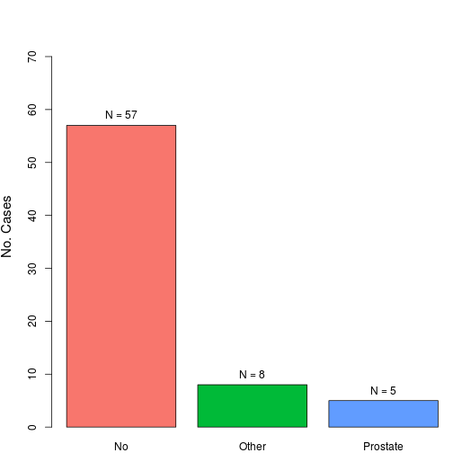 

```r
descriptive.categorical(var)
```


|         | No. Cases |  %   |
|:--------|:---------:|:----:|
|No       |    57     | 81.4 |
|Other    |     8     | 11.4 |
|Prostate |     5     |  7.1 |

***

### Patient's outcome

```r
var <- Data_Wide$Outcome
categorical.plot(var)
```

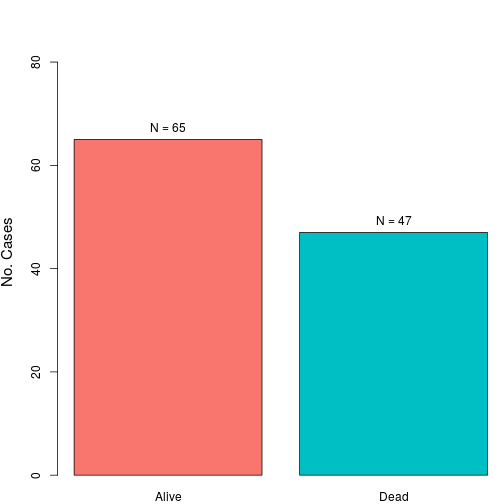 

```r
descriptive.categorical(var)
```


|      | No. Cases | %  |
|:-----|:---------:|:--:|
|Alive |    65     | 58 |
|Dead  |    47     | 42 |

***

### Cancer-related death

```r
var <- Data_Wide$DOD
categorical.plot(var)
```

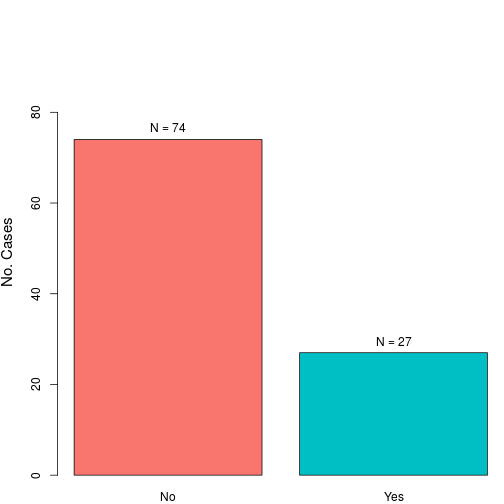 

```r
descriptive.categorical(var)
```


|    | No. Cases | %  |
|:---|:---------:|:--:|
|No  |    74     | 73 |
|Yes |    27     | 27 |

***

### Tumor progression

```r
var <- Data_Wide$Progression
categorical.plot(var)
```

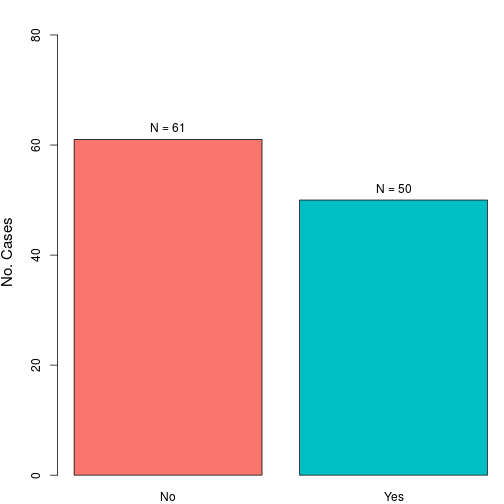 

```r
descriptive.categorical(var)
```


|    | No. Cases | %  |
|:---|:---------:|:--:|
|No  |    61     | 55 |
|Yes |    50     | 45 |

***

### Follow-up from surgery, months

```r
var <- Data_Wide$FU/30
lab <- "Follow-up, months"
numerical.plot(var, label = lab)
```

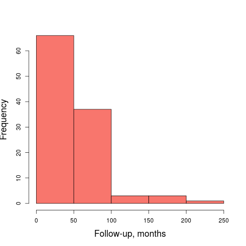 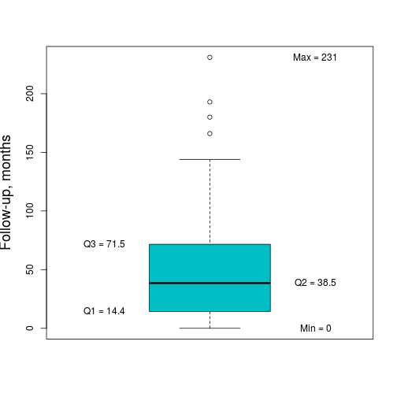 

```r
descriptive.numerical(var)
```


|Statistics          | Values |
|:-------------------|:------:|
|Mean                |  47.6  |
|Standard Deviation  |  41.4  |
|Median              |  38.5  |
|Interquartile Range |  57.1  |
|Mininum             |   0    |
|Maximum             |  231   |

***
