## PFCK expression in nontumor tissue

```r
# Loading the dataset for analysis
source("PFCK_RCC_Tidy.R")
# Loading the simpleR package
library(simpleR)
```

### Percentage of PDL1+ nontumor cells

```r
var <- Data$PDL1_Nontumor_Percentage
lab <- "PDL1+ nontumor cells, %"
numerical.plot(var, label = lab)
```

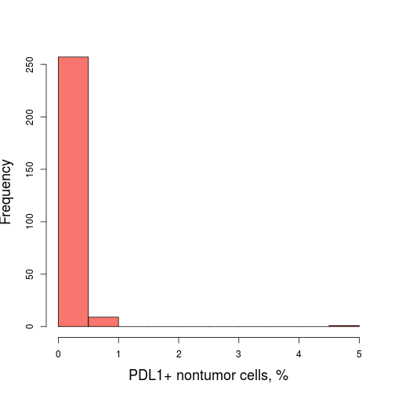 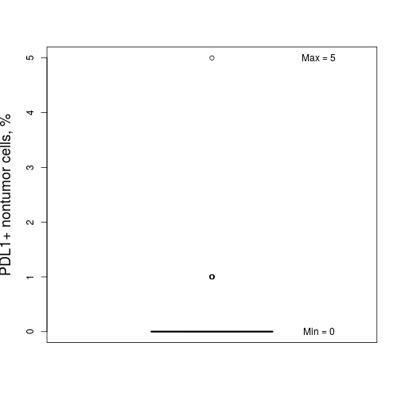 

```r
descriptive.numerical(var)
```


|Statistics          | Values |
|:-------------------|:------:|
|Mean                |  0.1   |
|Standard Deviation  |  0.4   |
|Median              |   0    |
|Interquartile Range |   0    |
|Mininum             |   0    |
|Maximum             |   5    |

***

### Location of PDL1 positivity in nontumor cell structure

```r
var <- Data$PDL1_Nontumor_Location
categorical.plot(var)
```

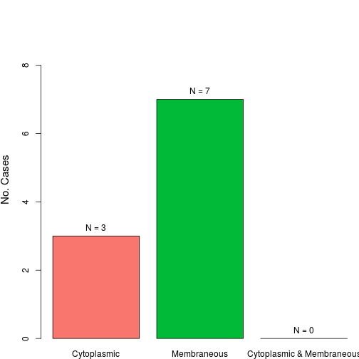 

```r
descriptive.categorical(var)
```


|                          | No. Cases | %  |
|:-------------------------|:---------:|:--:|
|Cytoplasmic               |     3     | 30 |
|Membraneous               |     7     | 70 |
|Cytoplasmic & Membraneous |     0     |  0 |

***

### H-score of PDL1 expression in nontumor cells

```r
var <- Data$PDL1_Nontumor_H
lab <- "PDL1 H-score in nontumor cells"
numerical.plot(var, label = lab)
```

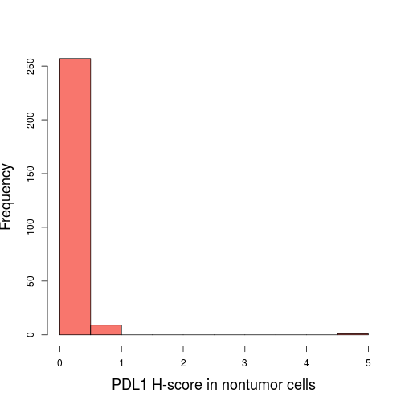 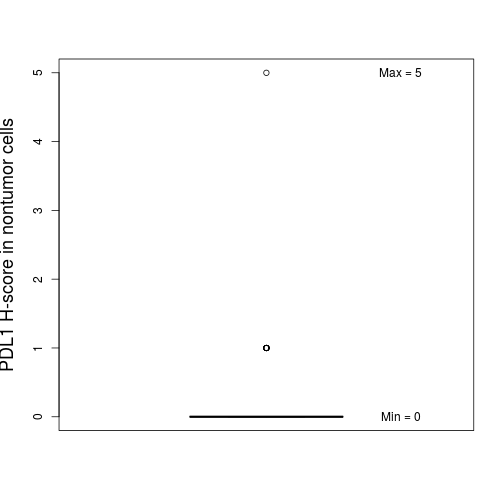 

```r
descriptive.numerical(var)
```


|Statistics          | Values |
|:-------------------|:------:|
|Mean                |  0.1   |
|Standard Deviation  |  0.4   |
|Median              |   0    |
|Interquartile Range |   0    |
|Mininum             |   0    |
|Maximum             |   5    |

***

### Percentage of PDL1+ inflammatory cells in stroma of nontumor tissue

```r
var <- Data$PDL1_Nontumor_Stroma_Percentage
lab <- "PDL1+ in stroma of nontumor tissue, %"
numerical.plot(var, label = lab)
```

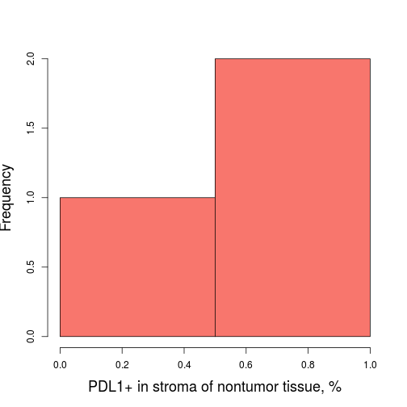 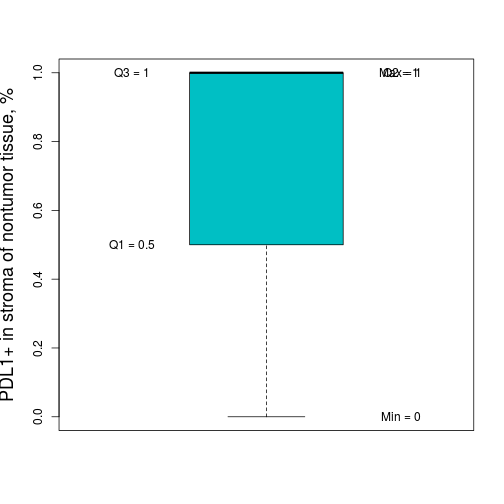 

```r
descriptive.numerical(var)
```


|Statistics          | Values |
|:-------------------|:------:|
|Mean                |  0.7   |
|Standard Deviation  |  0.6   |
|Median              |   1    |
|Interquartile Range |  0.5   |
|Mininum             |   0    |
|Maximum             |   1    |

***

### Total host response in nontumor tissue and stroma

```r
var <- Data$Host_Response_Nontumor
categorical.plot(var)
```

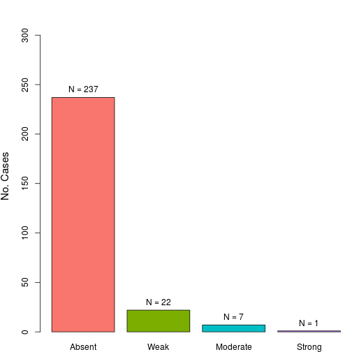 

```r
descriptive.categorical(var)
```


|         | No. Cases |   %   |
|:--------|:---------:|:-----:|
|Absent   |    237    | 88.76 |
|Weak     |     22    |  8.24 |
|Moderate |      7    |  2.62 |
|Strong   |      1    |  0.37 |

***

### Number of FOXP3+ lymphocytes in nontumor tissue

```r
var <- Data$PDL1_Nontumor_Stroma_Percentage
lab <- "FOXP3+ lymphocytes in nontumor tissue"
numerical.plot(var, label = lab)
```

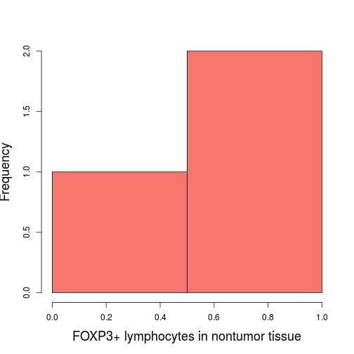  

```r
descriptive.numerical(var)
```


|Statistics          | Values |
|:-------------------|:------:|
|Mean                |  0.7   |
|Standard Deviation  |  0.6   |
|Median              |   1    |
|Interquartile Range |  0.5   |
|Mininum             |   0    |
|Maximum             |   1    |

***

### Number of FOXP3+ lymphocytes in stroma of nontumor tissue

```r
var <- Data$FOXP3_Nontumor_Stroma_Lymphocytes
lab <- "FOXP3+ lymphocytes in nontumor tissue stroma"
numerical.plot(var, label = lab)
```

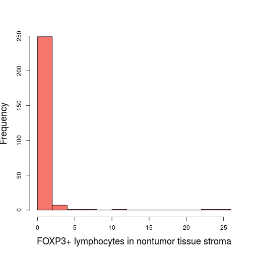 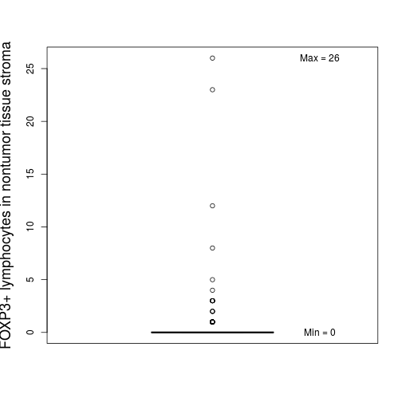 

```r
descriptive.numerical(var)
```


|Statistics          | Values |
|:-------------------|:------:|
|Mean                |  0.5   |
|Standard Deviation  |  2.4   |
|Median              |   0    |
|Interquartile Range |   0    |
|Mininum             |   0    |
|Maximum             |   26   |

***

### Intensity of FOXP3 staining in lymphocytes in nontumor tissue

```r
var <- Data$FOXP3_Nontumor_Lymphocytes_Intensity
categorical.plot(var)
```

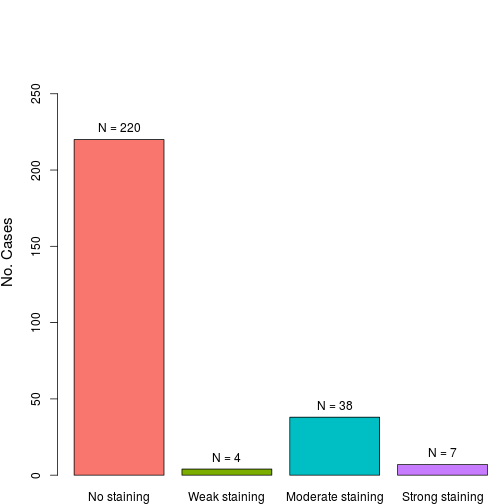 

```r
descriptive.categorical(var)
```


|                  | No. Cases |  %   |
|:-----------------|:---------:|:----:|
|No staining       |    220    | 81.8 |
|Weak staining     |      4    |  1.5 |
|Moderate staining |     38    | 14.1 |
|Strong staining   |      7    |  2.6 |

***

### Number of FOXP3+ nontumor cells

```r
var <- Data$FOXP3_Nontumor
lab <- "FOXP3+ nontumor cells"
numerical.plot(var, label = lab)
```

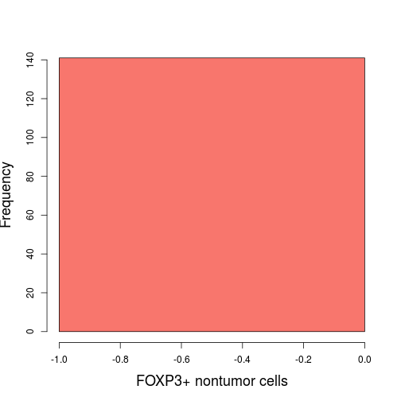 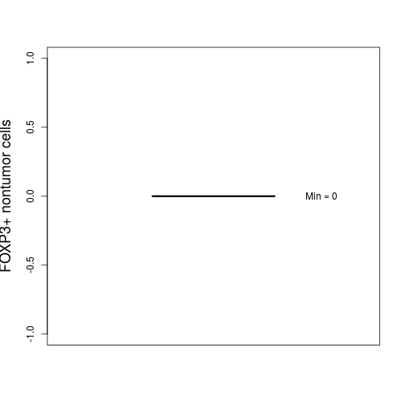 

```r
descriptive.numerical(var)
```


|Statistics          | Values |
|:-------------------|:------:|
|Mean                |   0    |
|Standard Deviation  |   0    |
|Median              |   0    |
|Interquartile Range |   0    |
|Mininum             |   0    |
|Maximum             |   0    |

***

### Intensity of FOXP3 staining in nontumor cells

```r
var <- Data$FOXP3_Nontumor_Intensity
categorical.plot(var)
```

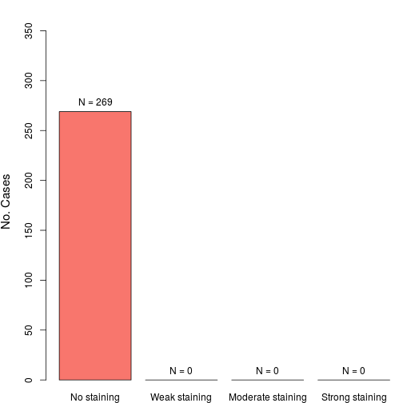 

```r
descriptive.categorical(var)
```


|                  | No. Cases |  %  |
|:-----------------|:---------:|:---:|
|No staining       |    269    | 100 |
|Weak staining     |      0    |   0 |
|Moderate staining |      0    |   0 |
|Strong staining   |      0    |   0 |

***

### Percentage of FOXP3+ nontumor cells

```r
var <- Data$FOXP3_Nontumor_Percentage
lab <- "FOXP3+ nontumor cells, %"
numerical.plot(var, label = lab)
```

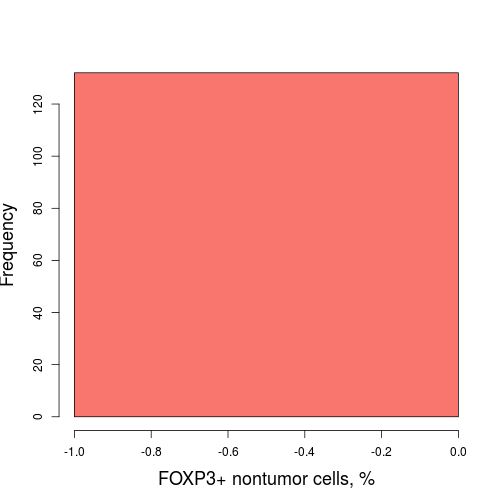 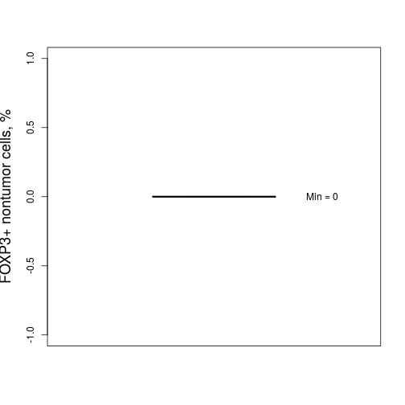 

```r
descriptive.numerical(var)
```


|Statistics          | Values |
|:-------------------|:------:|
|Mean                |   0    |
|Standard Deviation  |   0    |
|Median              |   0    |
|Interquartile Range |   0    |
|Mininum             |   0    |
|Maximum             |   0    |

***

### Number of CD8+ in nontumor tissue

```r
var <- Data$CD8_Nontumor
lab <- "CD8+ in nontumor tissue"
numerical.plot(var, label = lab)
```

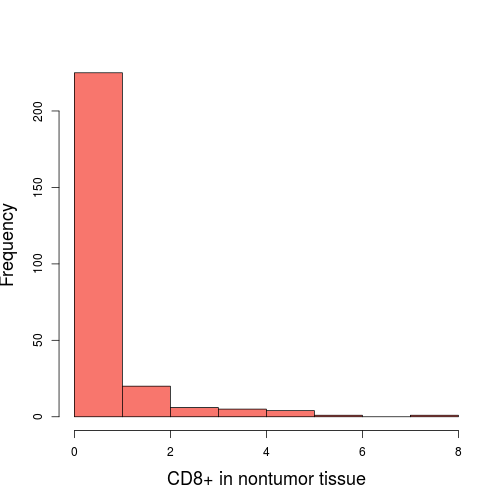 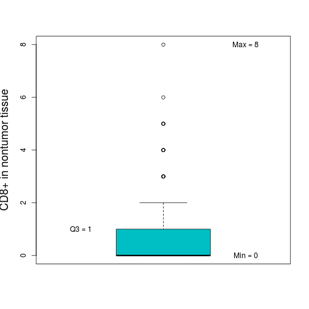 

```r
descriptive.numerical(var)
```


|Statistics          | Values |
|:-------------------|:------:|
|Mean                |  0.6   |
|Standard Deviation  |  1.2   |
|Median              |   0    |
|Interquartile Range |   1    |
|Mininum             |   0    |
|Maximum             |   8    |

***

### Number of CD8+/Ki67+ lymphocytes in nontumor tissue

```r
var <- Data$CD8_Ki67_Nontumor
lab <- "CD8+/Ki67+ lymphocytes in nontumor tissue"
numerical.plot(var, label = lab)
```

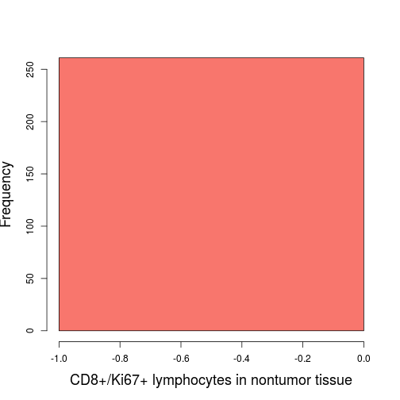 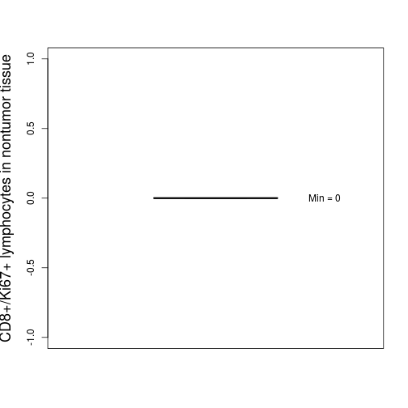 

```r
descriptive.numerical(var)
```


|Statistics          | Values |
|:-------------------|:------:|
|Mean                |   0    |
|Standard Deviation  |   0    |
|Median              |   0    |
|Interquartile Range |   0    |
|Mininum             |   0    |
|Maximum             |   0    |

***

### Number of CD8+ in stroma of nontumor tissue

```r
var <- Data$CD8_Nontumor_Stroma
lab <- "CD8+ in nontumor tissue stroma"
numerical.plot(var, label = lab)
```

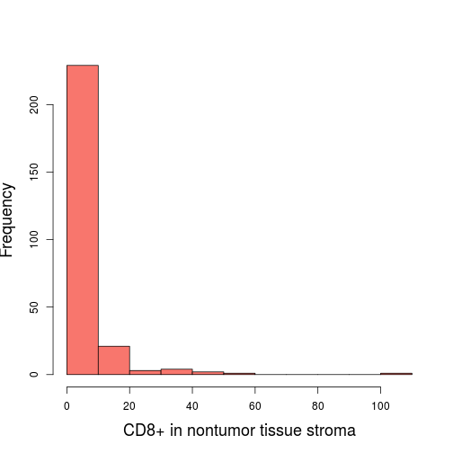 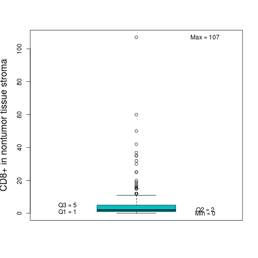 

```r
descriptive.numerical(var)
```


|Statistics          | Values |
|:-------------------|:------:|
|Mean                |  5.2   |
|Standard Deviation  |  10.1  |
|Median              |   2    |
|Interquartile Range |   4    |
|Mininum             |   0    |
|Maximum             |  107   |

***

### Number of CD8+/Ki67+ in stroma of nontumor tissue

```r
var <- Data$CD8_Ki67_Nontumor_Stroma
lab <- "CD8+/Ki67+ in nontumor tissue stroma"
numerical.plot(var, label = lab)
```

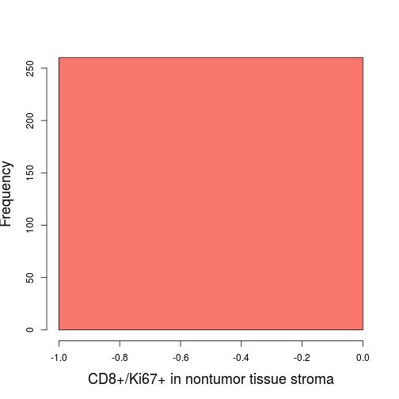 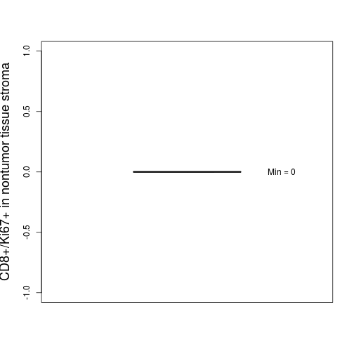 

```r
descriptive.numerical(var)
```


|Statistics          | Values |
|:-------------------|:------:|
|Mean                |   0    |
|Standard Deviation  |   0    |
|Median              |   0    |
|Interquartile Range |   0    |
|Mininum             |   0    |
|Maximum             |   0    |

***

### Percentage of Ki67+ nontumor cells

```r
var <- Data$Ki67_Nontumor_Percentage
lab <- "Ki67+ non tumor cells, %"
numerical.plot(var, label = lab)
```

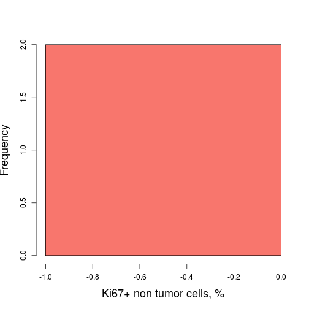 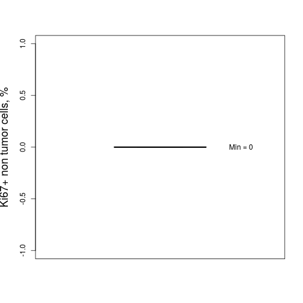 

```r
descriptive.numerical(var)
```


|Statistics          | Values |
|:-------------------|:------:|
|Mean                |   0    |
|Standard Deviation  |   0    |
|Median              |   0    |
|Interquartile Range |   0    |
|Mininum             |   0    |
|Maximum             |   0    |

***
