## PFCK expression in tumor tissue

```r
# Loading the dataset for analysis
source("PFCK_RCC_Tidy.R")
# Loading the simpleR package
library(simpleR)
```

### Percentage of PDL1+ tumor cells

```r
var <- Data$PDL1_Tumor_Percentage
lab <- "PDL1+ tumor cells, %"
numerical.plot(var, label = lab)
```

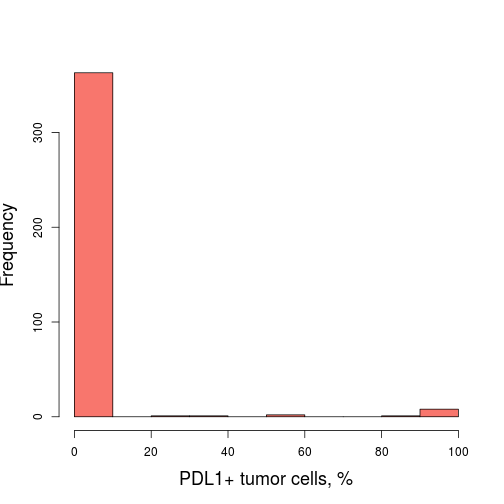 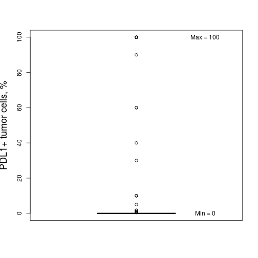 

```r
descriptive.numerical(var)
```


|Statistics          | Values |
|:-------------------|:------:|
|Mean                |   3    |
|Standard Deviation  |  15.9  |
|Median              |   0    |
|Interquartile Range |   0    |
|Mininum             |   0    |
|Maximum             |  100   |

***

### Location of PDL1 positivity in tumor cell structure

```r
var <- Data$PDL1_Tumor_Location
categorical.plot(var)
```

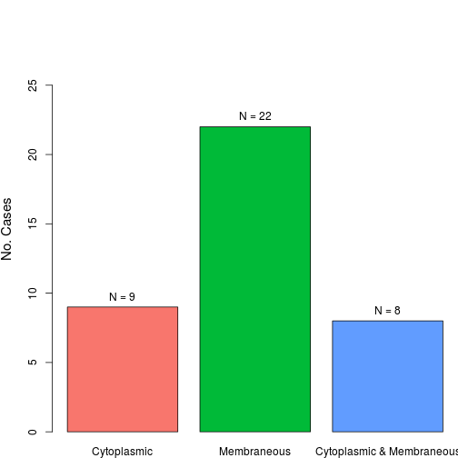 

```r
descriptive.categorical(var)
```


|                          | No. Cases | %  |
|:-------------------------|:---------:|:--:|
|Cytoplasmic               |     9     | 23 |
|Membraneous               |    22     | 56 |
|Cytoplasmic & Membraneous |     8     | 21 |

***

### H-score of PDL1 expression in tumor cells

```r
var <- Data$PDL1_Tumor_H
lab <- "PDL1 H-score in tumor cells"
numerical.plot(var, label = lab)
```

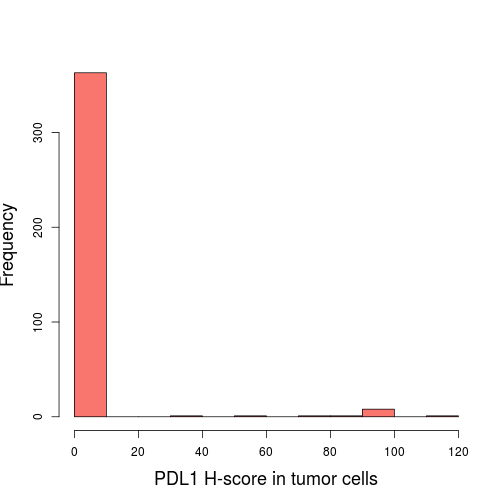  

```r
descriptive.numerical(var)
```


|Statistics          | Values |
|:-------------------|:------:|
|Mean                |  3.3   |
|Standard Deviation  |  17.2  |
|Median              |   0    |
|Interquartile Range |   0    |
|Mininum             |   0    |
|Maximum             |  120   |

***

### Percentage of PDL1+ inflammatory cells in stroma of tumor tissue

```r
var <- Data$PDL1_Tumor_Stroma_Percentage
lab <- "PDL1+ in stroma of tumor tissue, %"
numerical.plot(var, label = lab)
```

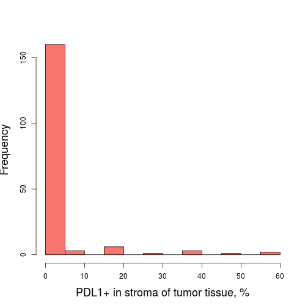 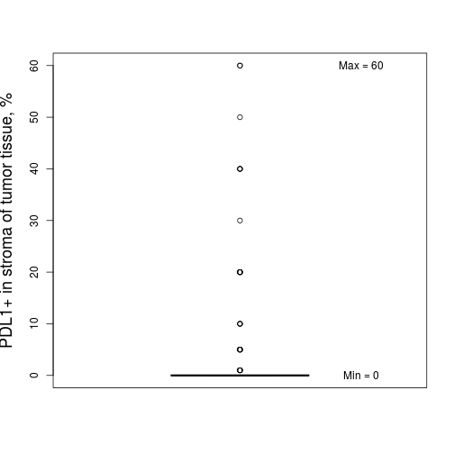 

```r
descriptive.numerical(var)
```


|Statistics          | Values |
|:-------------------|:------:|
|Mean                |  2.9   |
|Standard Deviation  |  9.8   |
|Median              |   0    |
|Interquartile Range |   0    |
|Mininum             |   0    |
|Maximum             |   60   |

***

### Total host response in tumor tissue and stroma

```r
var <- Data$Host_Response_Tumor
categorical.plot(var)
```

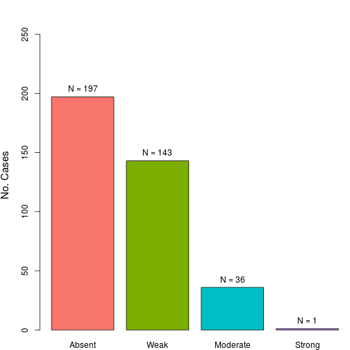 

```r
descriptive.categorical(var)
```


|         | No. Cases |   %   |
|:--------|:---------:|:-----:|
|Absent   |    197    | 52.25 |
|Weak     |    143    | 37.93 |
|Moderate |     36    |  9.55 |
|Strong   |      1    |  0.27 |

***

### Number of FOXP3+ lymphocytes in tumor tissue

```r
var <- Data$PDL1_Tumor_Stroma_Percentage
lab <- "FOXP3+ lymphocytes in tumor tissue"
numerical.plot(var, label = lab)
```

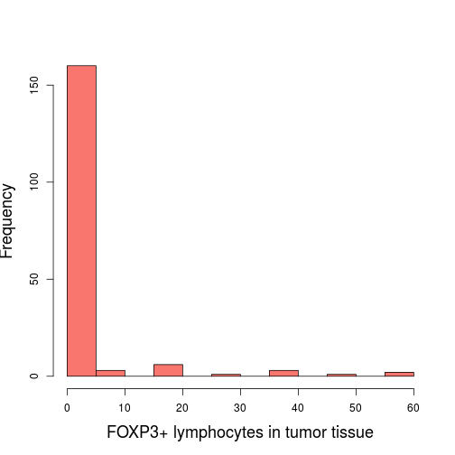 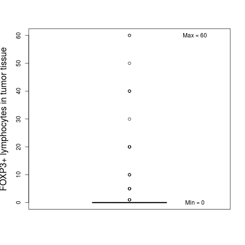 

```r
descriptive.numerical(var)
```


|Statistics          | Values |
|:-------------------|:------:|
|Mean                |  2.9   |
|Standard Deviation  |  9.8   |
|Median              |   0    |
|Interquartile Range |   0    |
|Mininum             |   0    |
|Maximum             |   60   |

***

### Number of FOXP3+ lymphocytes in stroma of tumor tissue

```r
var <- Data$FOXP3_Tumor_Stroma_Lymphocytes
lab <- "FOXP3+ lymphocytes in tumor tissue stroma"
numerical.plot(var, label = lab)
```

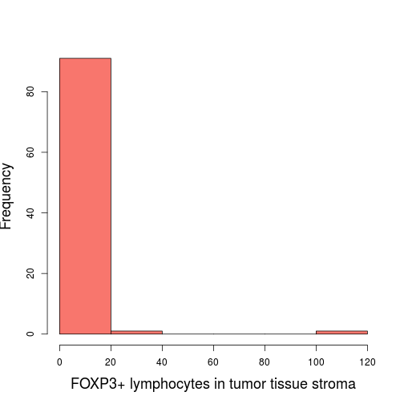 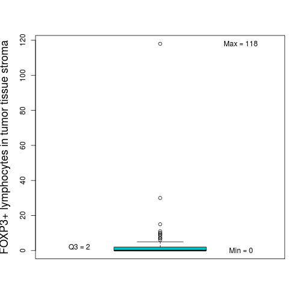 

```r
descriptive.numerical(var)
```


|Statistics          | Values |
|:-------------------|:------:|
|Mean                |  3.1   |
|Standard Deviation  |  12.8  |
|Median              |   0    |
|Interquartile Range |   2    |
|Mininum             |   0    |
|Maximum             |  118   |

***

### Intensity of FOXP3 staining in lymphocytes in tumor tissue

```r
var <- Data$FOXP3_Tumor_Lymphocytes_Intensity
categorical.plot(var)
```

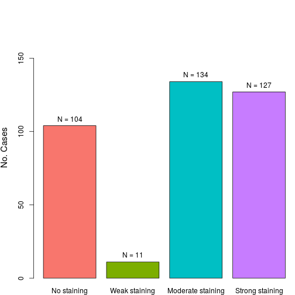 

```r
descriptive.categorical(var)
```


|                  | No. Cases |  %   |
|:-----------------|:---------:|:----:|
|No staining       |    104    | 27.7 |
|Weak staining     |     11    |  2.9 |
|Moderate staining |    134    | 35.6 |
|Strong staining   |    127    | 33.8 |

***

### Number of FOXP3+ tumor cells

```r
var <- Data$FOXP3_Tumor
lab <- "FOXP3+ tumor cells"
numerical.plot(var, label = lab)
```

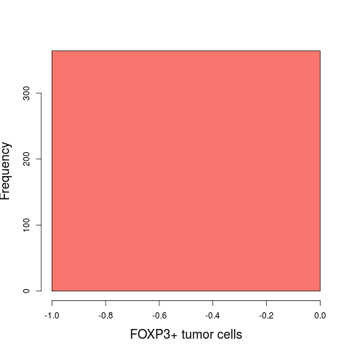 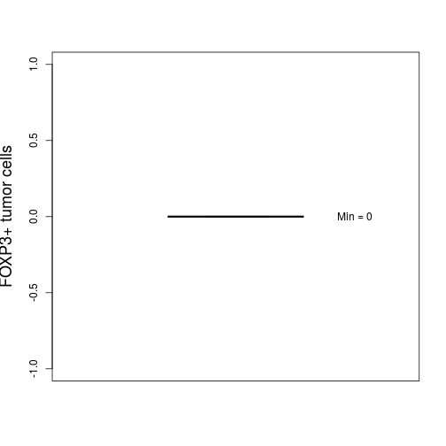 

```r
descriptive.numerical(var)
```


|Statistics          | Values |
|:-------------------|:------:|
|Mean                |   0    |
|Standard Deviation  |   0    |
|Median              |   0    |
|Interquartile Range |   0    |
|Mininum             |   0    |
|Maximum             |   0    |

***

### Intensity of FOXP3 staining in tumor cells

```r
var <- Data$FOXP3_Tumor_Intensity
categorical.plot(var)
```

 

```r
descriptive.categorical(var)
```


|                  | No. Cases |  %  |
|:-----------------|:---------:|:---:|
|No staining       |    413    | 100 |
|Weak staining     |      0    |   0 |
|Moderate staining |      0    |   0 |
|Strong staining   |      0    |   0 |

***

### Percentage of FOXP3+ tumor cells

```r
var <- Data$FOXP3_Tumor_Percentage
lab <- "FOXP3+ tumor cells, %"
numerical.plot(var, label = lab)
```

 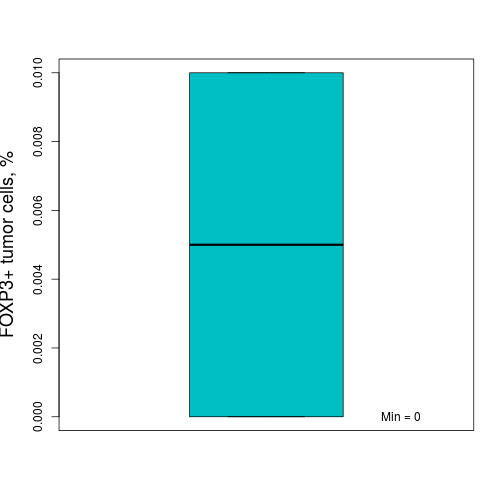 

```r
descriptive.numerical(var)
```


|Statistics          | Values |
|:-------------------|:------:|
|Mean                |   0    |
|Standard Deviation  |   0    |
|Median              |   0    |
|Interquartile Range |   0    |
|Mininum             |   0    |
|Maximum             |   0    |

***

### Number of CD8+ in tumor tissue

```r
var <- Data$CD8_Tumor
lab <- "CD8+ in tumor tissue"
numerical.plot(var, label = lab)
```

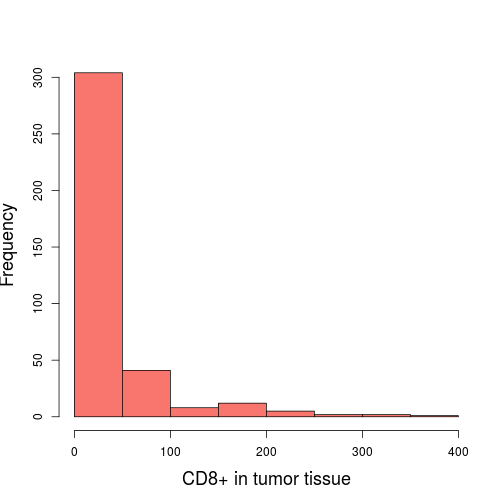 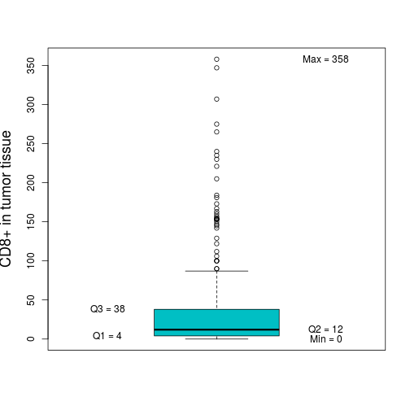 

```r
descriptive.numerical(var)
```


|Statistics          | Values |
|:-------------------|:------:|
|Mean                |  33.4  |
|Standard Deviation  |  54.5  |
|Median              |   12   |
|Interquartile Range |   34   |
|Mininum             |   0    |
|Maximum             |  358   |

***

### Number of CD8+/Ki67+ lymphocytes in tumor tissue

```r
var <- Data$CD8_Ki67_Tumor
lab <- "CD8+/Ki67+ lymphocytes in tumor tissue"
numerical.plot(var, label = lab)
```

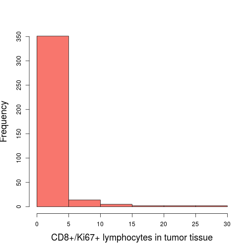 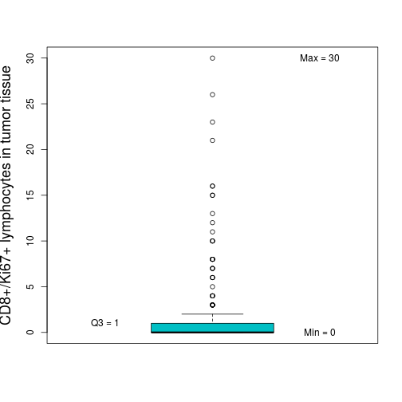 

```r
descriptive.numerical(var)
```


|Statistics          | Values |
|:-------------------|:------:|
|Mean                |  1.1   |
|Standard Deviation  |  3.5   |
|Median              |   0    |
|Interquartile Range |   1    |
|Mininum             |   0    |
|Maximum             |   30   |

***

### Number of CD8+ in stroma of tumor tissue

```r
var <- Data$CD8_Tumor_Stroma
lab <- "CD8+ in tumor tissue stroma"
numerical.plot(var, label = lab)
```

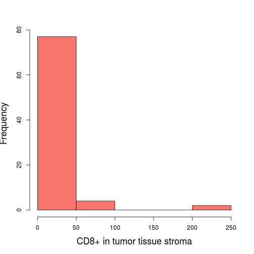 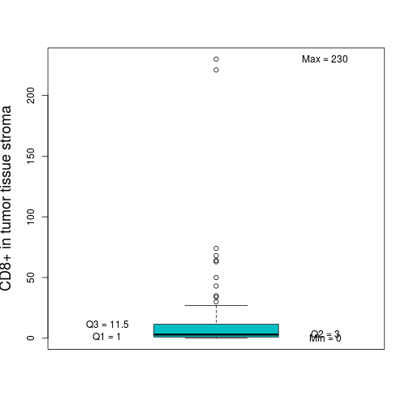 

```r
descriptive.numerical(var)
```


|Statistics          | Values |
|:-------------------|:------:|
|Mean                |  15.4  |
|Standard Deviation  |   37   |
|Median              |   3    |
|Interquartile Range |  10.5  |
|Mininum             |   0    |
|Maximum             |  230   |

***

### Number of CD8+/Ki67+ in stroma of tumor tissue

```r
var <- Data$CD8_Ki67_Tumor_Stroma
lab <- "CD8+/Ki67+ in tumor tissue stroma"
numerical.plot(var, label = lab)
```

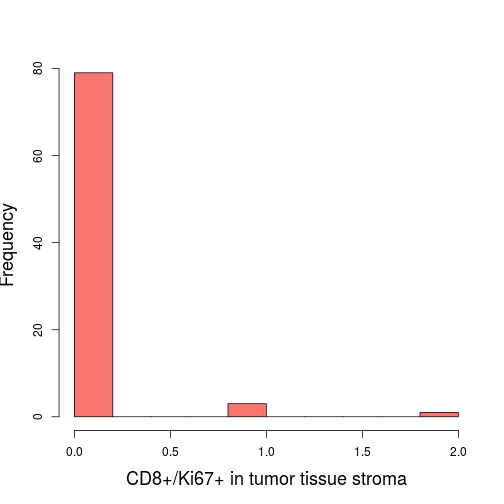 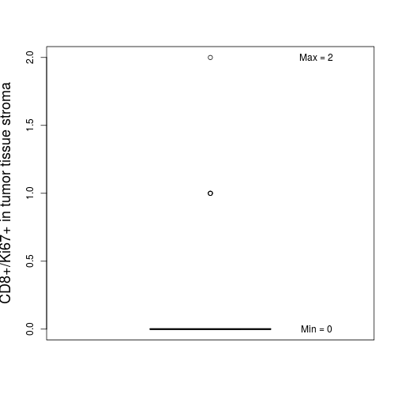 

```r
descriptive.numerical(var)
```


|Statistics          | Values |
|:-------------------|:------:|
|Mean                |  0.1   |
|Standard Deviation  |  0.3   |
|Median              |   0    |
|Interquartile Range |   0    |
|Mininum             |   0    |
|Maximum             |   2    |

***

### Percentage of Ki67+ tumor cells

```r
var <- Data$Ki67_Tumor_Percentage
lab <- "Ki67+ non tumor cells, %"
numerical.plot(var, label = lab)
```

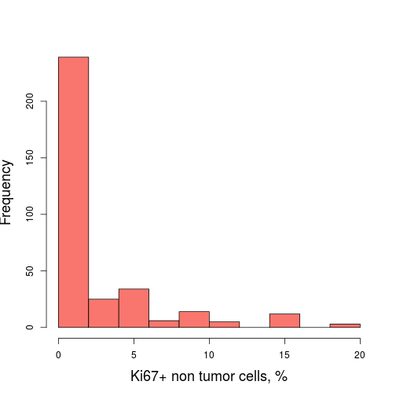 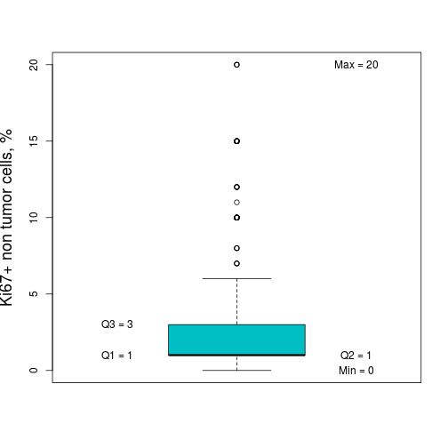 

```r
descriptive.numerical(var)
```


|Statistics          | Values |
|:-------------------|:------:|
|Mean                |  2.9   |
|Standard Deviation  |  3.8   |
|Median              |   1    |
|Interquartile Range |   2    |
|Mininum             |   0    |
|Maximum             |   20   |

***
