## PFCK expression in nontumor vs. tumor tissue

```r
# Loading the dataset for analysis
source("PFCK_RCC_Tidy.R")
# Selecting only primary cases
Data <- subset(Data, Tissue == "Primary")
# Loading the simpleR package
library(simpleR)
# Sourcing functions for paired data
source("Paired_Data.R")
# Setting global options
knitr::opts_chunk$set(message = FALSE, warning = FALSE, fig.width = 9)
# Versus variables and labels
Data$Tissue_T <- "Tumor Tissue"
Data$Tissue_NT <- "Nontumor Tissue"
Tissue_Type <- factor(c(Data$Tissue_NT, Data$Tissue_T))
NT_lab <- "Nontumor tissue"
T_lab <- "Tumor tissue"
```

### Percentage of PDL1+ nontumor vs. tumor cells

```r
NT_var <- log10(Data$PDL1_Nontumor_Percentage + 1)
T_var <- log10(Data$PDL1_Tumor_Percentage + 1)
yaxis <- "PDL1+ cells, log %"
numerical.group.plot2(NT_var, T_var, NT_lab, T_lab, labmain = yaxis)
```

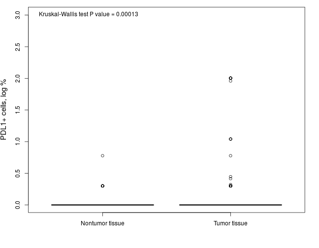 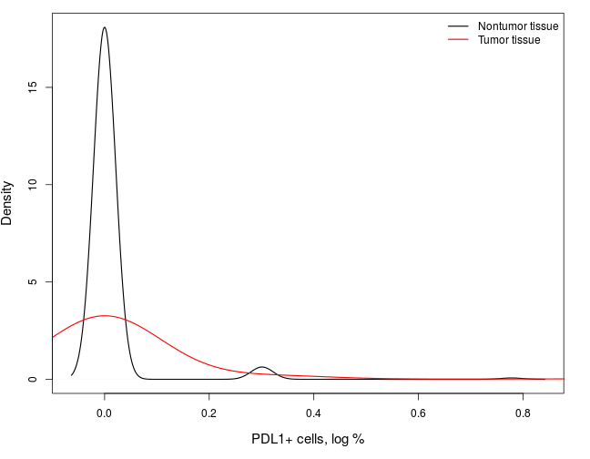 

|Statistics          | Nontumor tissue | Tumor tissue |
|:-------------------|:---------------:|:------------:|
|Mean                |        0        |     0.1      |
|Standard Deviation  |       0.1       |     0.4      |
|Median              |        0        |      0       |
|Interquartile Range |        0        |      0       |
|Mininum             |        0        |      0       |
|Maximum             |       0.8       |      2       |

***

### Location of PDL1 positivity in nontumor vs. tumor cell structure

```r
NT_var <- Data$PDL1_Nontumor_Location
T_var <- Data$PDL1_Tumor_Location
NvT <- unlist(list(NT_var, T_var))
labx <- "Location of PDL1 positivity"
categorical.group.plot2(NvT, Tissue_Type, xlab = labx)
```

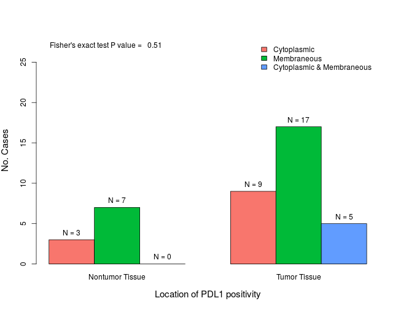 

|                          | Nontumor Tissue | Tumor Tissue |
|:-------------------------|:---------------:|:------------:|
|Cytoplasmic               |        3        |      9       |
|Membraneous               |        7        |      17      |
|Cytoplasmic & Membraneous |        0        |      5       |

***

### H-score of PDL1 expression in nontumor vs. tumor cells

```r
NT_var <- log10(Data$PDL1_Nontumor_H + 1)
T_var <- log10(Data$PDL1_Tumor_H + 1)
yaxis <- "PDL1, log H-score"
numerical.group.plot2(NT_var, T_var, NT_lab, T_lab, labmain = yaxis)
```

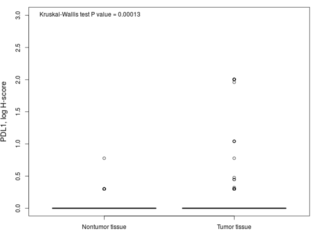 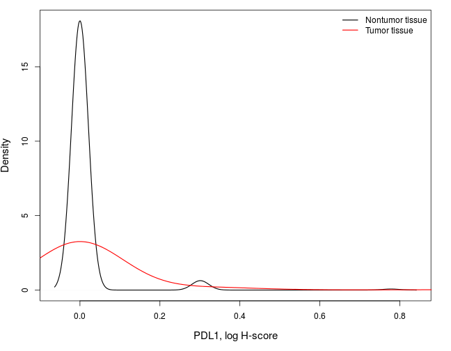 

|Statistics          | Nontumor tissue | Tumor tissue |
|:-------------------|:---------------:|:------------:|
|Mean                |        0        |     0.1      |
|Standard Deviation  |       0.1       |     0.4      |
|Median              |        0        |      0       |
|Interquartile Range |        0        |      0       |
|Mininum             |        0        |      0       |
|Maximum             |       0.8       |      2       |

***

### Percentage of PDL1+ inflammatory cells in stroma of nontumor vs. tumor tissue

```r
NT_var <- log10(Data$PDL1_Nontumor_Stroma_Percentage + 1)
T_var <- log10(Data$PDL1_Tumor_Stroma_Percentage + 1)
yaxis <- "PDL1+ in stroma, log %"
numerical.group.plot2(NT_var, T_var, NT_lab, T_lab, labmain = yaxis)
```

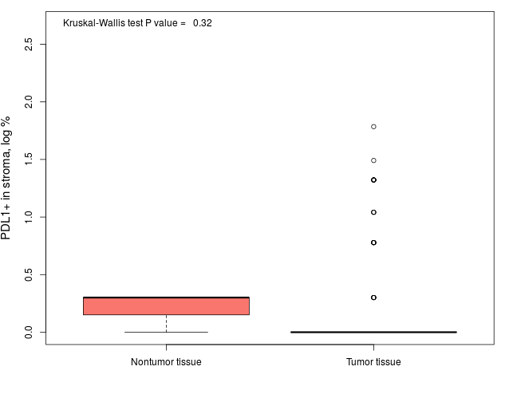 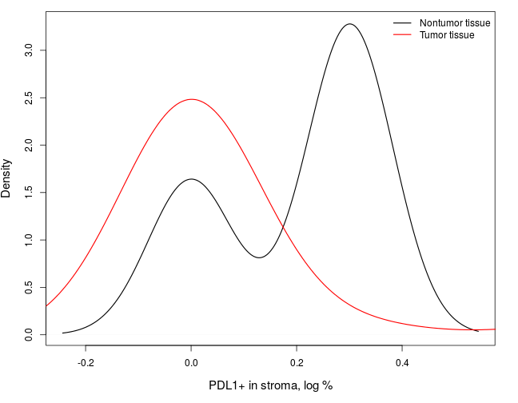 

|Statistics          | Nontumor tissue | Tumor tissue |
|:-------------------|:---------------:|:------------:|
|Mean                |       0.2       |     0.2      |
|Standard Deviation  |       0.2       |     0.4      |
|Median              |       0.3       |      0       |
|Interquartile Range |       0.2       |      0       |
|Mininum             |        0        |      0       |
|Maximum             |       0.3       |     1.8      |

***

### Total host response in nontumor vs. tumor tissue and stroma

```r
NT_var <- Data$Host_Response_Nontumor
T_var <- Data$Host_Response_Tumor
NvT <- unlist(list(NT_var, T_var))
labx <- "Total host response"
categorical.group.plot2(NvT, Tissue_Type, xlab = labx)
```

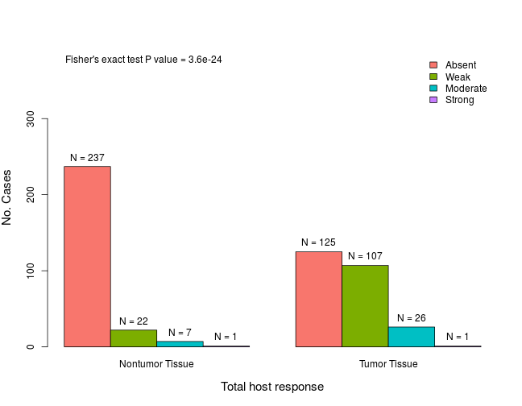 

|         | Nontumor Tissue | Tumor Tissue |
|:--------|:---------------:|:------------:|
|Absent   |       237       |     125      |
|Weak     |       22        |     107      |
|Moderate |        7        |      26      |
|Strong   |        1        |      1       |

***

### Number of FOXP3+ lymphocytes in nontumor vs. tumor tissue

```r
NT_var <- log10(Data$FOXP3_Nontumor_Lymphocytes + 1)
T_var <- log10(Data$FOXP3_Tumor_Lymphocytes + 1)
yaxis <- "FOXP3+ lymphocytes, log"
numerical.group.plot2(NT_var, T_var, NT_lab, T_lab, labmain = yaxis)
```

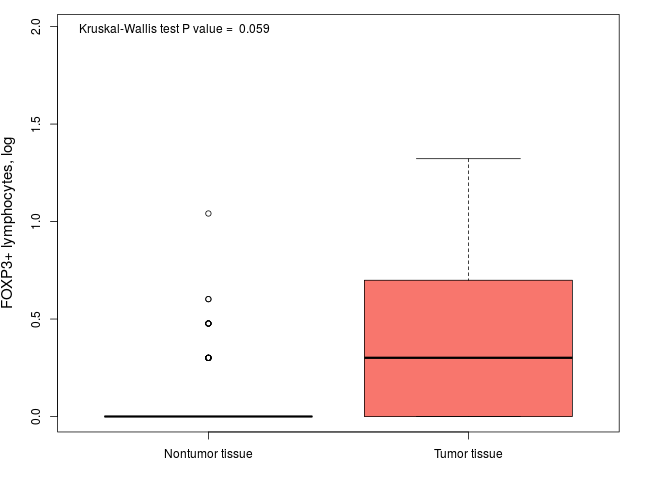 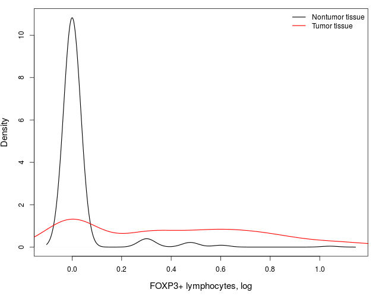 

|Statistics          | Nontumor tissue | Tumor tissue |
|:-------------------|:---------------:|:------------:|
|Mean                |        0        |     0.4      |
|Standard Deviation  |       0.1       |     0.4      |
|Median              |        0        |     0.3      |
|Interquartile Range |        0        |     0.7      |
|Mininum             |        0        |      0       |
|Maximum             |        1        |     1.3      |

***

### Number of FOXP3+ lymphocytes in stroma of nontumor vs. tumor tissue

```r
NT_var <- log10(Data$FOXP3_Nontumor_Stroma_Lymphocytes + 1)
T_var <- log10(Data$FOXP3_Tumor_Stroma_Lymphocytes + 1)
yaxis <- "FOXP3+ lymphocytes in stroma, log"
numerical.group.plot2(NT_var, T_var, NT_lab, T_lab, labmain = yaxis)
```

 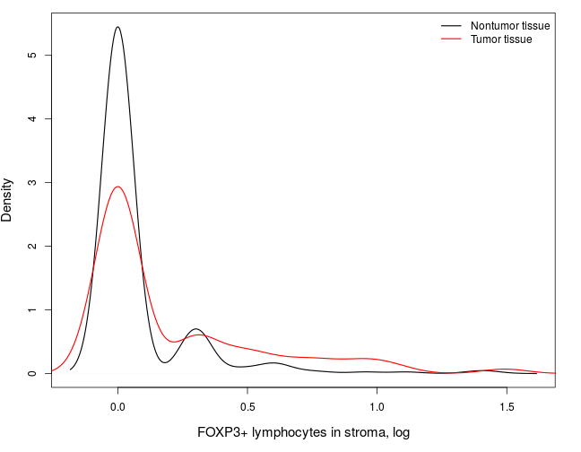 

|Statistics          | Nontumor tissue | Tumor tissue |
|:-------------------|:---------------:|:------------:|
|Mean                |       0.1       |     0.2      |
|Standard Deviation  |       0.2       |     0.4      |
|Median              |        0        |      0       |
|Interquartile Range |        0        |     0.3      |
|Mininum             |        0        |      0       |
|Maximum             |       1.4       |     2.1      |

***

### Intensity of FOXP3 staining in lymphocytes in nontumor vs. tumor tissue

```r
NT_var <- Data$FOXP3_Nontumor_Lymphocytes_Intensity
T_var <- Data$FOXP3_Tumor_Lymphocytes_Intensity
NvT <- unlist(list(NT_var, T_var))
labx <- "FOXP3 staining intensity in lymphocytes"
categorical.group.plot2(NvT, Tissue_Type, xlab = labx)
```

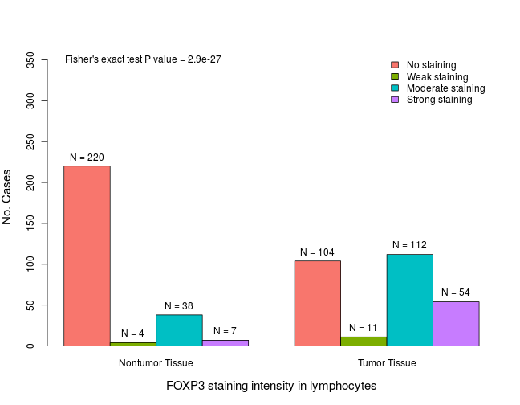 

|                  | Nontumor Tissue | Tumor Tissue |
|:-----------------|:---------------:|:------------:|
|No staining       |       220       |     104      |
|Weak staining     |        4        |      11      |
|Moderate staining |       38        |     112      |
|Strong staining   |        7        |      54      |

***

### Number of FOXP3+ nontumor vs. tumor cells

```r
NT_var <- log10(Data$FOXP3_Nontumor + 1)
T_var <- log10(Data$FOXP3_Tumor + 1)
yaxis <- "FOXP3+ cells, log"
numerical.group.plot2(NT_var, T_var, NT_lab, T_lab, labmain = yaxis)
```

No plots or comparisons are generated due to the fact that all observations had the same values.

***

### Intensity of FOXP3 staining in nontumor vs. tumor cells

```r
NT_var <- Data$FOXP3_Nontumor_Intensity
T_var <- Data$FOXP3_Tumor_Intensity
NvT <- unlist(list(NT_var, T_var))
labx <- "FOXP3 staining intensity"
categorical.group.plot2(NvT, Tissue_Type, xlab = labx)
```

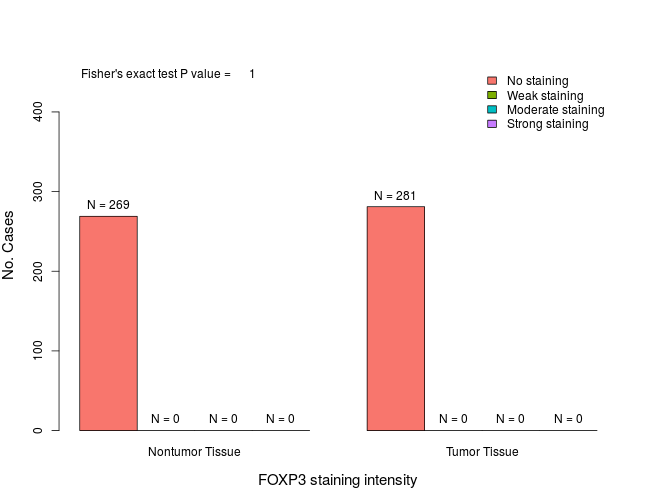 

|                  | Nontumor Tissue | Tumor Tissue |
|:-----------------|:---------------:|:------------:|
|No staining       |       269       |     281      |
|Weak staining     |        0        |      0       |
|Moderate staining |        0        |      0       |
|Strong staining   |        0        |      0       |

***

### Percentage of FOXP3+ nontumor vs. tumor cells

```r
NT_var <- log10(Data$FOXP3_Nontumor_Percentage + 1)
T_var <- log10(Data$FOXP3_Tumor_Percentage + 1)
yaxis <- "FOXP3+ cells, % log"
numerical.group.plot2(NT_var, T_var, NT_lab, T_lab, labmain = yaxis)
```

No plots or comparisons are generated due to the fact that all observations had the same value.

***

### Number of CD8+ in nontumor vs. tumor tissue

```r
NT_var <- log10(Data$CD8_Nontumor + 1)
T_var <- log10(Data$CD8_Tumor + 1)
yaxis <- "CD8+ cells, log"
numerical.group.plot2(NT_var, T_var, NT_lab, T_lab, labmain = yaxis)
```

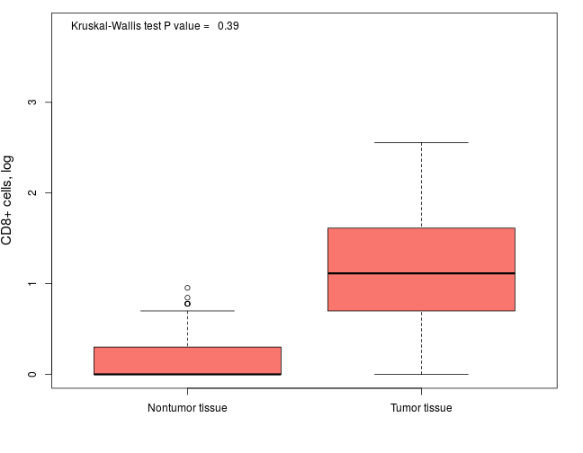 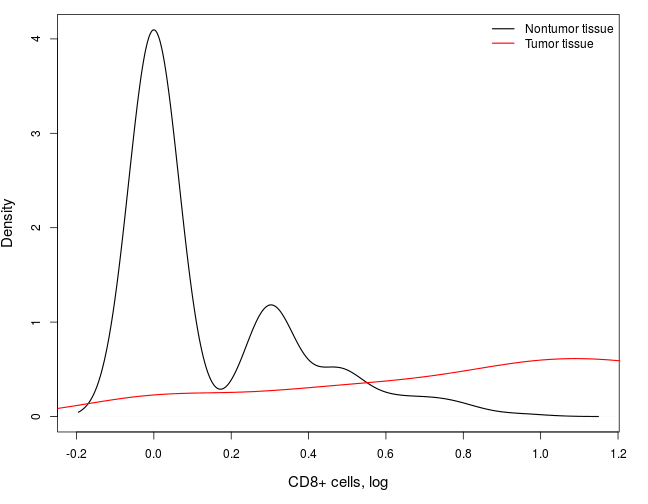 

|Statistics          | Nontumor tissue | Tumor tissue |
|:-------------------|:---------------:|:------------:|
|Mean                |       0.1       |     1.1      |
|Standard Deviation  |       0.2       |     0.6      |
|Median              |        0        |     1.1      |
|Interquartile Range |       0.3       |     0.9      |
|Mininum             |        0        |      0       |
|Maximum             |        1        |     2.6      |

***

### Number of CD8+/Ki67+ lymphocytes in nontumor vs. tumor tissue

```r
NT_var <- Data$CD8_Ki67_Nontumor
T_var <- Data$CD8_Ki67_Tumor
yaxis <- "CD8+/Ki67+ lymphocytes, log"
numerical.group.plot2(NT_var, T_var, NT_lab, T_lab, labmain = yaxis)
```

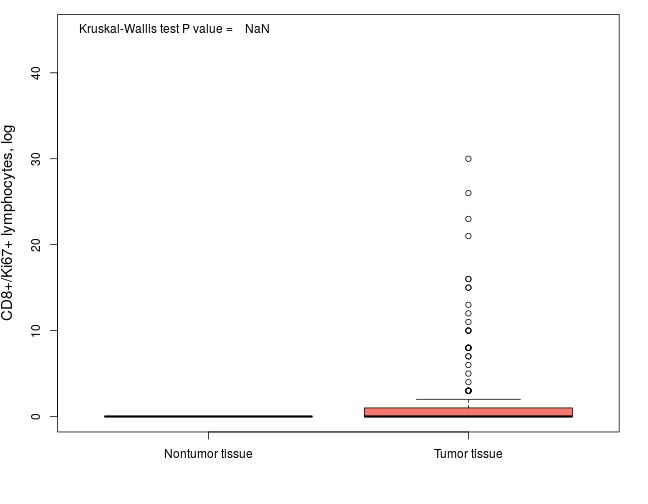 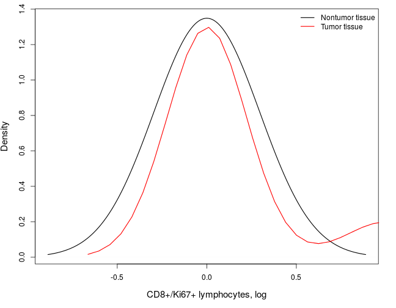 

|Statistics          | Nontumor tissue | Tumor tissue |
|:-------------------|:---------------:|:------------:|
|Mean                |        0        |     1.4      |
|Standard Deviation  |        0        |     4.1      |
|Median              |        0        |      0       |
|Interquartile Range |        0        |      1       |
|Mininum             |        0        |      0       |
|Maximum             |        0        |      30      |

***

### Number of CD8+ in stroma of nontumor vs. tumor tissue

```r
NT_var <- Data$CD8_Nontumor_Stroma
T_var <- Data$CD8_Tumor_Stroma
yaxis <- "CD8+ cells in stroma, log"
numerical.group.plot2(NT_var, T_var, NT_lab, T_lab, labmain = yaxis)
```

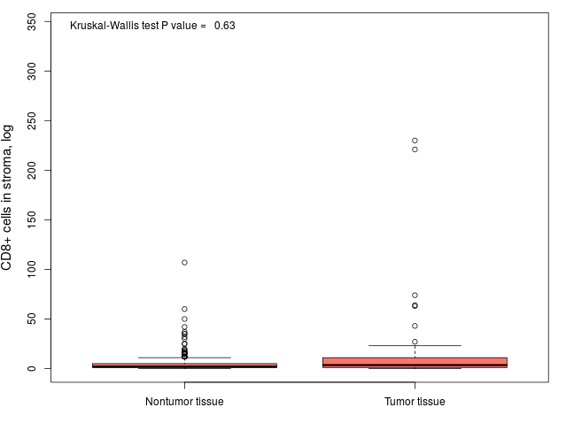 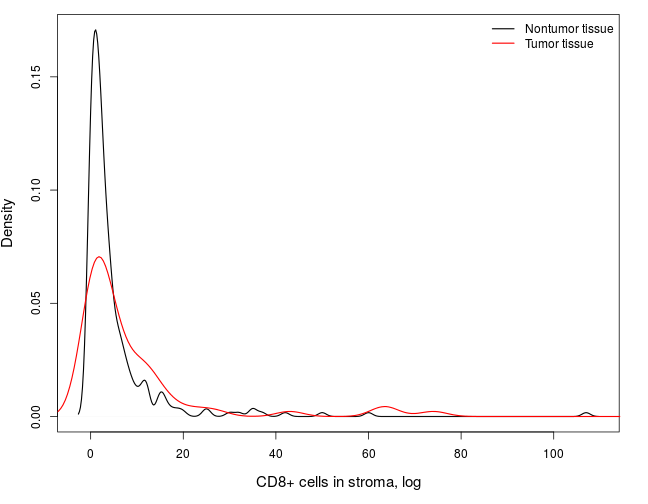 

|Statistics          | Nontumor tissue | Tumor tissue |
|:-------------------|:---------------:|:------------:|
|Mean                |       5.2       |     16.5     |
|Standard Deviation  |      10.1       |     42.1     |
|Median              |        2        |     3.5      |
|Interquartile Range |        4        |      10      |
|Mininum             |        0        |      0       |
|Maximum             |       107       |     230      |

***

### Number of CD8+/Ki67+ in stroma of nontumor vs. tumor tissue

```r
NT_var <- Data$CD8_Ki67_Nontumor_Stroma
T_var <- Data$CD8_Ki67_Tumor_Stroma
yaxis <- "CD8+/Ki67+ cells in stroma, log"
numerical.group.plot2(NT_var, T_var, NT_lab, T_lab, labmain = yaxis)
```

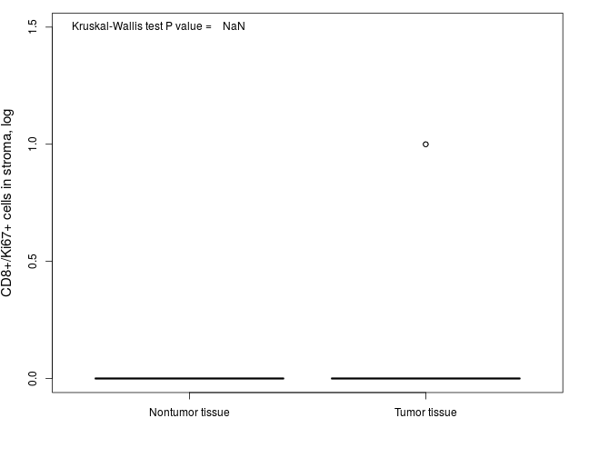 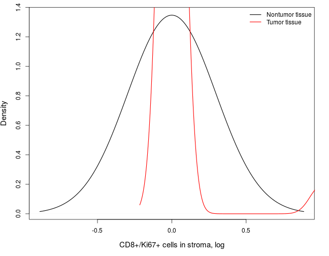 

|Statistics          | Nontumor tissue | Tumor tissue |
|:-------------------|:---------------:|:------------:|
|Mean                |        0        |      0       |
|Standard Deviation  |        0        |     0.2      |
|Median              |        0        |      0       |
|Interquartile Range |        0        |      0       |
|Mininum             |        0        |      0       |
|Maximum             |        0        |      1       |

***

### Percentage of Ki67+ nontumor vs. tumor cells

```r
NT_var <- Data$Ki67_Nontumor_Percentage
T_var <- Data$Ki67_Tumor_Percentage
yaxis <- "Ki67+ cells, log %"
numerical.group.plot2(NT_var, T_var, NT_lab, T_lab, labmain = yaxis)
```

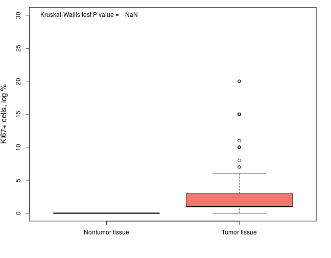 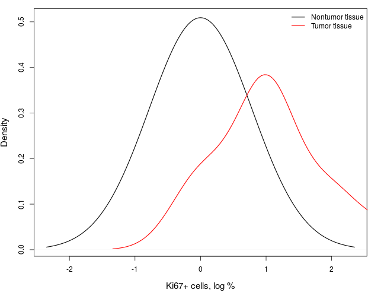 

|Statistics          | Nontumor tissue | Tumor tissue |
|:-------------------|:---------------:|:------------:|
|Mean                |        0        |     2.8      |
|Standard Deviation  |        0        |     3.9      |
|Median              |        0        |      1       |
|Interquartile Range |        0        |      2       |
|Mininum             |        0        |      0       |
|Maximum             |        0        |      20      |

***
