## PFCK expression in primary vs. metastatic tumors

```r
# Loading the dataset for analysis
source("PFCK_RCC_Tidy.R")
# Loading the simpleR package
library(simpleR)
# Sourcing functions for paired data
source("Paired_Data.R")
# Setting global options
knitr::opts_chunk$set(message = FALSE, warning = FALSE, fig.width = 9)
# Versus variables
vary <- Data$Tissue
```

### Percentage of PDL1+ tumor cells

```r
varx <- log10(Data$PDL1_Tumor_Percentage + 1)
yaxis <- "PDL1+ cells, log %"
numerical.group.plot(varx, vary, lab = yaxis)
```

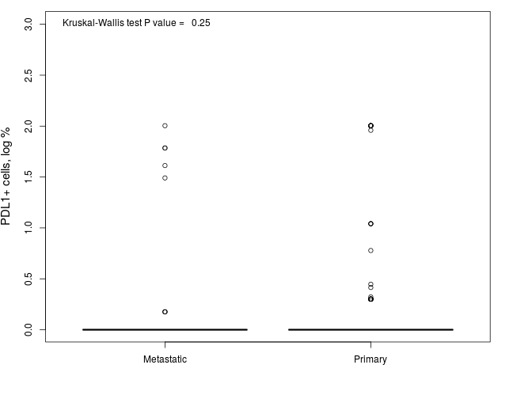 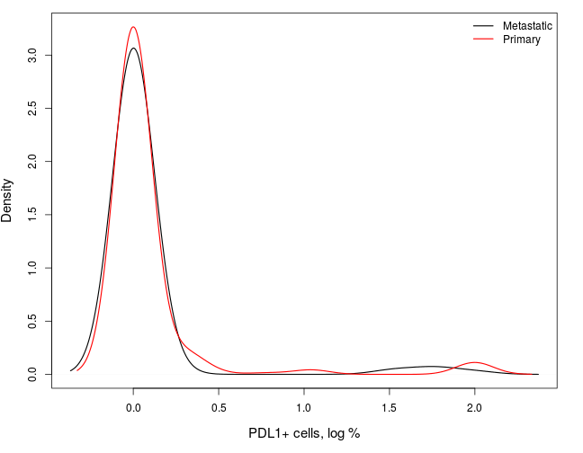 

|                    | Metastatic | Primary |
|:-------------------|:----------:|:-------:|
|Mean                |    0.1     |   0.1   |
|Standard Deviation  |    0.4     |   0.4   |
|Median              |    0.0     |   0.0   |
|Interquartile Range |    0.0     |   0.0   |
|Minimum             |    0.0     |   0.0   |
|Maximum             |    2.0     |   2.0   |

***

### Location of PDL1 positivity in tumor cell structure

```r
varx <- Data$PDL1_Tumor_Location
categorical.group.plot2(varx, vary)
```

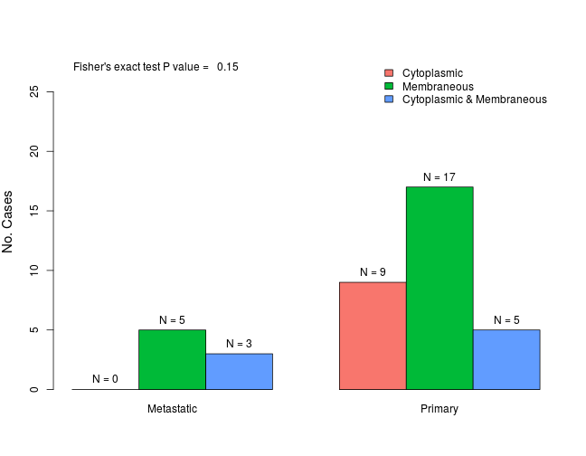 

|                          | Metastatic | Primary |
|:-------------------------|:----------:|:-------:|
|Cytoplasmic               |     0      |    9    |
|Membraneous               |     5      |   17    |
|Cytoplasmic & Membraneous |     3      |    5    |

***

### H-score of PDL1 expression in tumor cells

```r
varx <- log10(Data$PDL1_Tumor_H + 1)
yaxis <- "PDL1, log H-score"
numerical.group.plot(varx, vary, lab = yaxis)
```

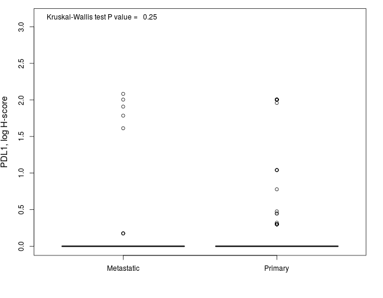 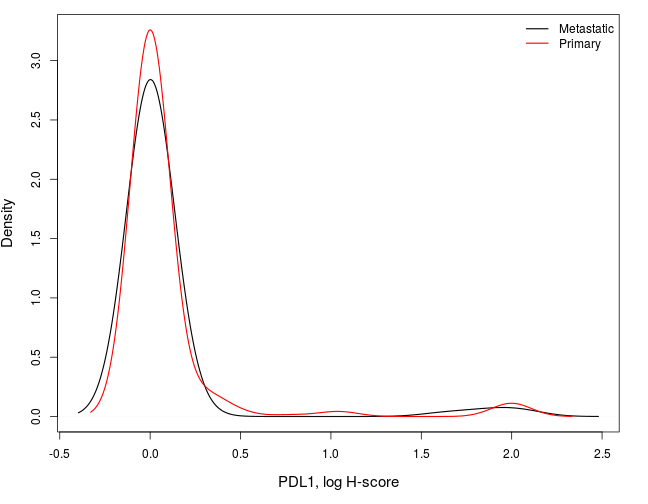 

|                    | Metastatic | Primary |
|:-------------------|:----------:|:-------:|
|Mean                |    0.1     |   0.1   |
|Standard Deviation  |    0.4     |   0.4   |
|Median              |    0.0     |   0.0   |
|Interquartile Range |    0.0     |   0.0   |
|Minimum             |    0.0     |   0.0   |
|Maximum             |    2.1     |   2.0   |

***

### Percentage of PDL1+ inflammatory cells in stroma of tumor tissue

```r
varx <- log10(Data$PDL1_Tumor_Stroma_Percentage + 1)
yaxis <- "PDL1+ inflammatory cells in stroma, log %"
numerical.group.plot(varx, vary, lab = yaxis)
```

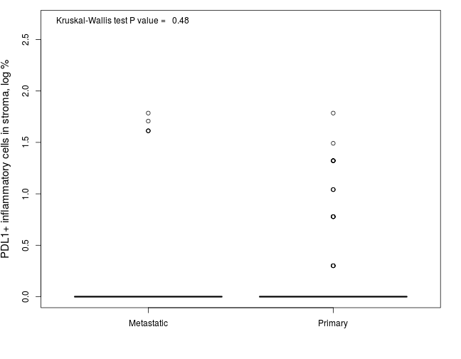 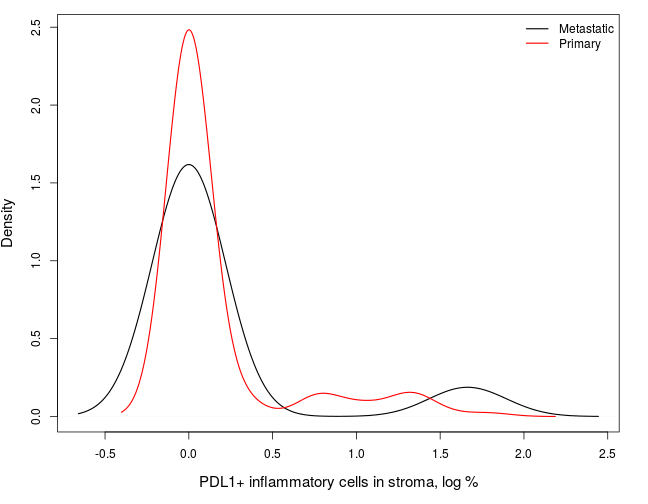 

|                    | Metastatic | Primary |
|:-------------------|:----------:|:-------:|
|Mean                |    0.2     |   0.2   |
|Standard Deviation  |    0.5     |   0.4   |
|Median              |    0.0     |   0.0   |
|Interquartile Range |    0.0     |   0.0   |
|Minimum             |    0.0     |   0.0   |
|Maximum             |    1.8     |   1.8   |

***

### Total host response in tumor tissue and stroma

```r
varx <- Data$Host_Response_Tumor
categorical.group.plot2(varx, vary)
```

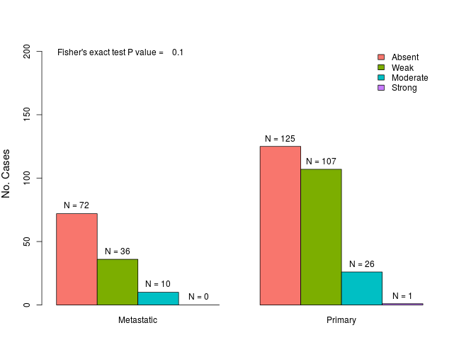 

|         | Metastatic | Primary |
|:--------|:----------:|:-------:|
|Absent   |     72     |   125   |
|Weak     |     36     |   107   |
|Moderate |     10     |   26    |
|Strong   |     0      |    1    |

***

### Number of FOXP3+ lymphocytes in tumor tissue

```r
varx <- log10(Data$FOXP3_Tumor_Lymphocytes + 1)
yaxis <- "FOXP3+ lymphocytes, log"
numerical.group.plot(varx, vary, lab = yaxis)
```

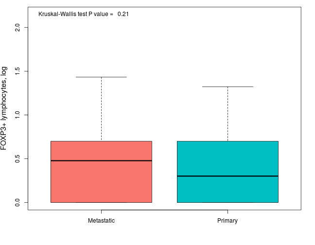  

|                    | Metastatic | Primary |
|:-------------------|:----------:|:-------:|
|Mean                |    0.5     |   0.4   |
|Standard Deviation  |    0.4     |   0.4   |
|Median              |    0.5     |   0.3   |
|Interquartile Range |    0.7     |   0.7   |
|Minimum             |    0.0     |   0.0   |
|Maximum             |    1.4     |   1.3   |

***

### Number of FOXP3+ lymphocytes in stroma of tumor tissue

```r
varx <- log10(Data$FOXP3_Tumor_Stroma_Lymphocytes + 1)
yaxis <- "FOXP3+ lymphocytes in stroma, log"
numerical.group.plot(varx, vary, lab = yaxis)
```

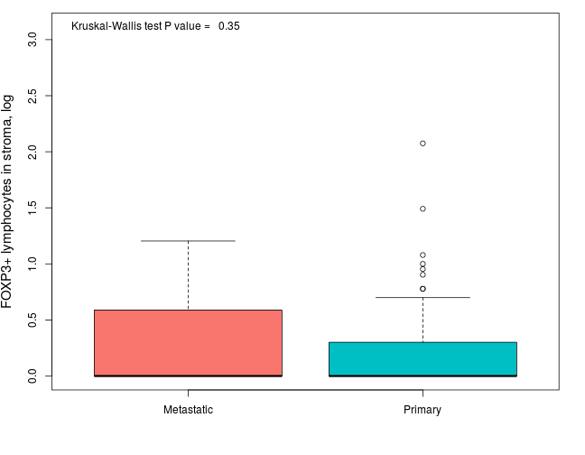 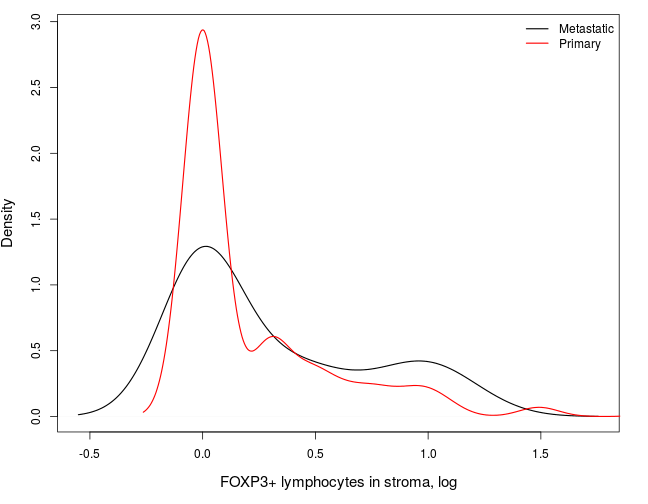 

|                    | Metastatic | Primary |
|:-------------------|:----------:|:-------:|
|Mean                |    0.3     |   0.2   |
|Standard Deviation  |    0.4     |   0.4   |
|Median              |    0.0     |   0.0   |
|Interquartile Range |    0.5     |   0.3   |
|Minimum             |    0.0     |   0.0   |
|Maximum             |    1.2     |   2.1   |

***

### Intensity of FOXP3 staining in lymphocytes in tumor tissue

```r
varx <- Data$FOXP3_Tumor_Lymphocytes_Intensity
categorical.group.plot2(varx, vary)
```

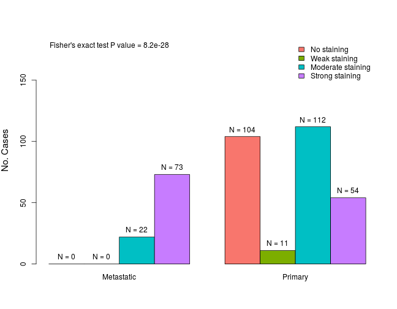 

|                  | Metastatic | Primary |
|:-----------------|:----------:|:-------:|
|No staining       |     0      |   104   |
|Weak staining     |     0      |   11    |
|Moderate staining |     22     |   112   |
|Strong staining   |     73     |   54    |

***

### Number of FOXP3+ tumor cells

```r
varx <- log10(Data$FOXP3_Tumor + 1)
yaxis <- "FOXP3+ tumor cells, log"
numerical.group.plot(varx, vary, lab = yaxis)
```

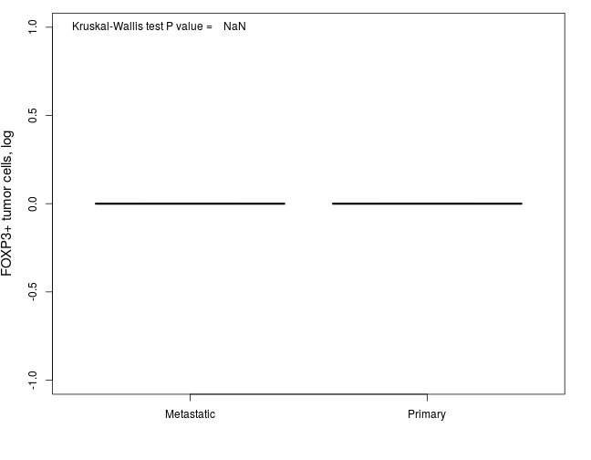 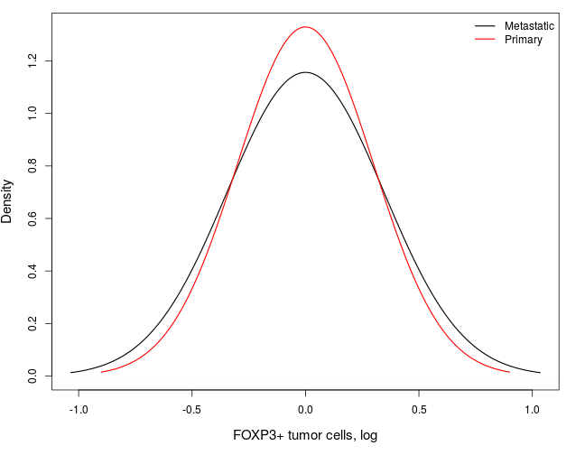 

|                    | Metastatic | Primary |
|:-------------------|:----------:|:-------:|
|Mean                |     0      |    0    |
|Standard Deviation  |     0      |    0    |
|Median              |     0      |    0    |
|Interquartile Range |     0      |    0    |
|Minimum             |     0      |    0    |
|Maximum             |     0      |    0    |

***

### Intensity of FOXP3 staining in tumor cells

```r
varx <- Data$FOXP3_Tumor_Intensity
categorical.group.plot2(varx, vary)
```

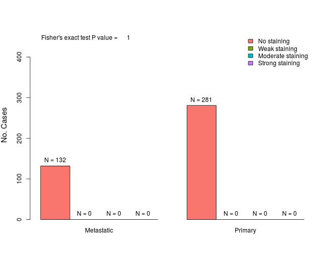 

|                  | Metastatic | Primary |
|:-----------------|:----------:|:-------:|
|No staining       |    132     |   281   |
|Weak staining     |     0      |    0    |
|Moderate staining |     0      |    0    |
|Strong staining   |     0      |    0    |

***

### Percentage of FOXP3+ tumor cells

```r
varx <- log10(Data$FOXP3_Tumor_Percentage + 1)
yaxis <- "FOXP3+ tumor cells, % log"
numerical.group.plot(varx, vary, lab = yaxis)
```

**Plots not generated:** all observations were in the same group.

***

### Number of CD8+ in tumor tissue

```r
varx <- log10(Data$CD8_Tumor + 1)
yaxis <- "CD8+ tumor cells, log"
numerical.group.plot(varx, vary, lab = yaxis)
```

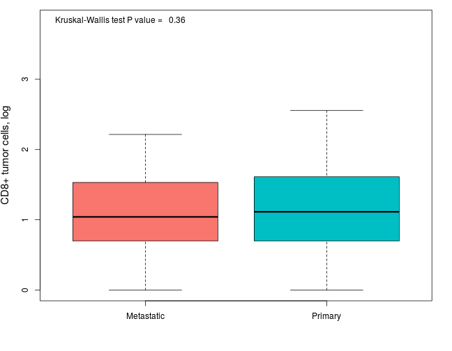 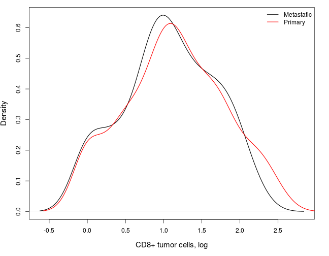 

|                    | Metastatic | Primary |
|:-------------------|:----------:|:-------:|
|Mean                |    1.1     |   1.1   |
|Standard Deviation  |    0.6     |   0.6   |
|Median              |    1.0     |   1.1   |
|Interquartile Range |    0.8     |   0.9   |
|Minimum             |    0.0     |   0.0   |
|Maximum             |    2.2     |   2.6   |

***

### Number of CD8+/Ki67+ lymphocytes in tumor tissue

```r
varx <- log10(Data$CD8_Ki67_Tumor + 1)
yaxis <- "CD8+/Ki67+ lymphocytes, log"
numerical.group.plot(varx, vary, lab = yaxis)
```

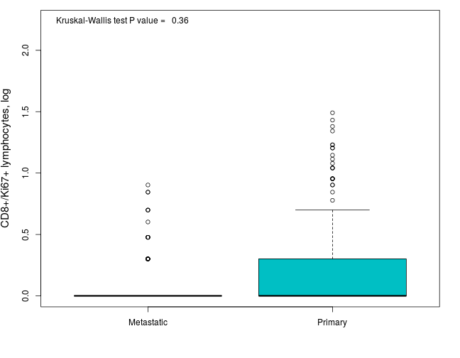 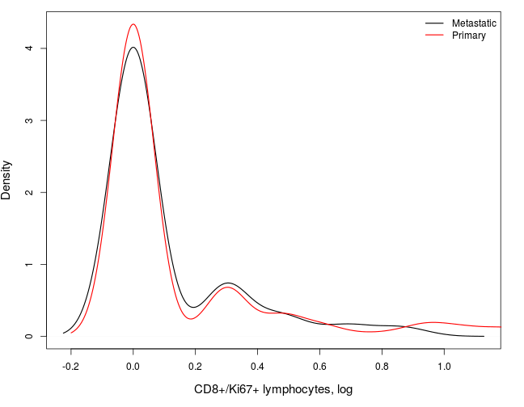 

|                    | Metastatic | Primary |
|:-------------------|:----------:|:-------:|
|Mean                |    0.1     |   0.2   |
|Standard Deviation  |    0.2     |   0.3   |
|Median              |    0.0     |   0.0   |
|Interquartile Range |    0.0     |   0.3   |
|Minimum             |    0.0     |   0.0   |
|Maximum             |    0.9     |   1.5   |

***

### Number of CD8+ in stroma of tumor tissue

```r
varx <- log10(Data$CD8_Tumor_Stroma + 1)
yaxis <- "CD8+ cells in stroma, log"
numerical.group.plot(varx, vary, lab = yaxis)
```

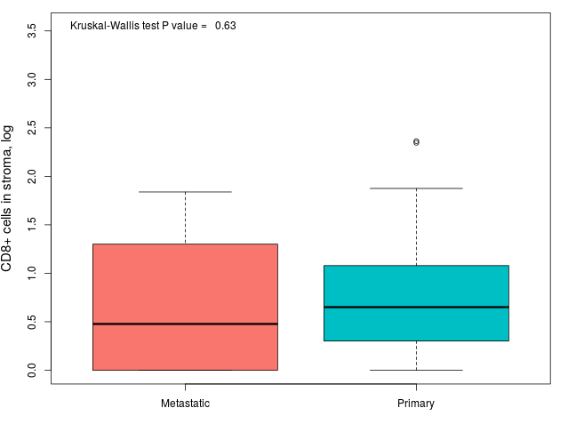 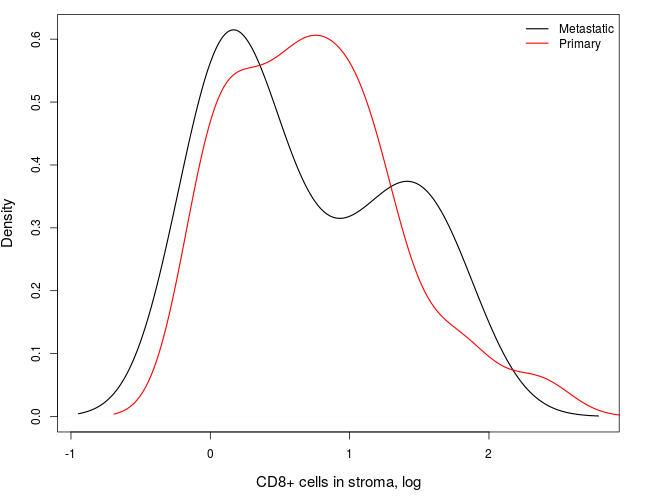 

|                    | Metastatic | Primary |
|:-------------------|:----------:|:-------:|
|Mean                |    0.7     |   0.7   |
|Standard Deviation  |    0.7     |   0.6   |
|Median              |    0.5     |   0.7   |
|Interquartile Range |    1.3     |   0.8   |
|Minimum             |    0.0     |   0.0   |
|Maximum             |    1.8     |   2.4   |

***

### Number of CD8+/Ki67+ in stroma of tumor tissue

```r
varx <- log10(Data$CD8_Ki67_Tumor_Stroma + 1)
yaxis <- "CD8+/Ki67+ cells in stroma, log"
numerical.group.plot(varx, vary, lab = yaxis)
```

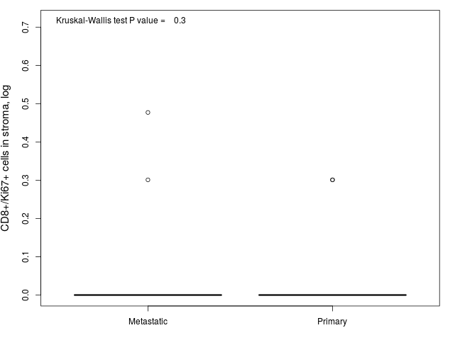 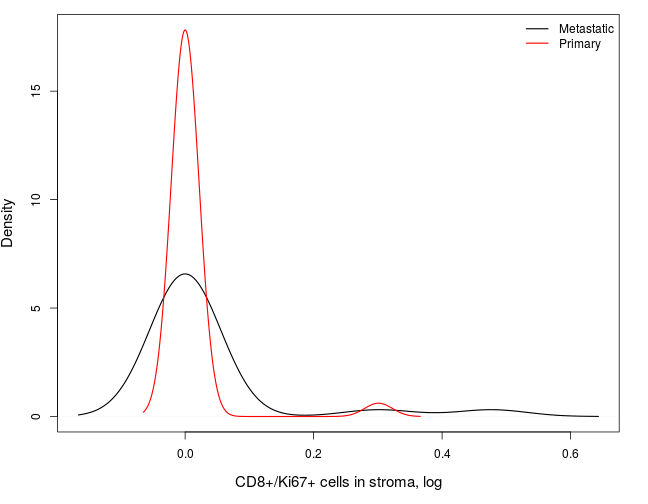 

|                    | Metastatic | Primary |
|:-------------------|:----------:|:-------:|
|Mean                |    0.0     |   0.0   |
|Standard Deviation  |    0.1     |   0.1   |
|Median              |    0.0     |   0.0   |
|Interquartile Range |    0.0     |   0.0   |
|Minimum             |    0.0     |   0.0   |
|Maximum             |    0.5     |   0.3   |

***

### Percentage of Ki67+ tumor cells

```r
varx <- log10(Data$Ki67_Tumor_Percentage + 1)
yaxis <- "Ki67+ tumor cells, log %"
numerical.group.plot(varx, vary, lab = yaxis)
```

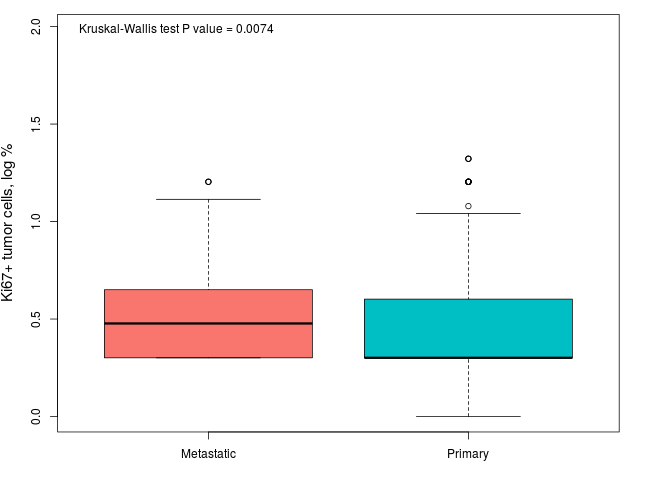  

|                    | Metastatic | Primary |
|:-------------------|:----------:|:-------:|
|Mean                |    0.5     |   0.4   |
|Standard Deviation  |    0.3     |   0.3   |
|Median              |    0.5     |   0.3   |
|Interquartile Range |    0.3     |   0.3   |
|Minimum             |    0.3     |   0.0   |
|Maximum             |    1.2     |   1.3   |

***
